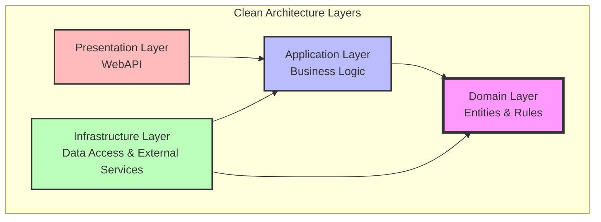
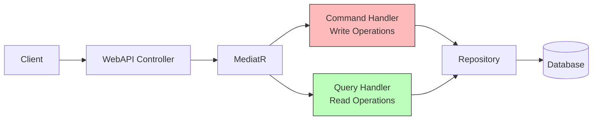
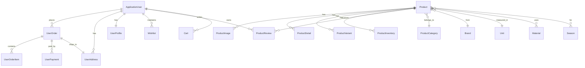
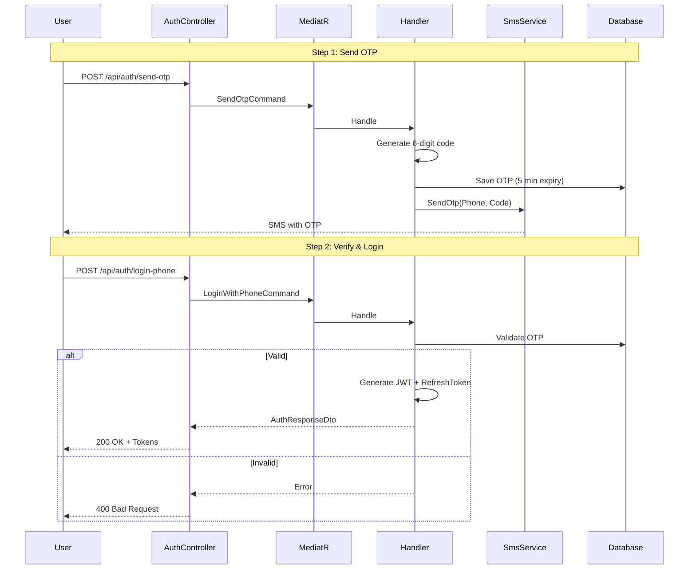
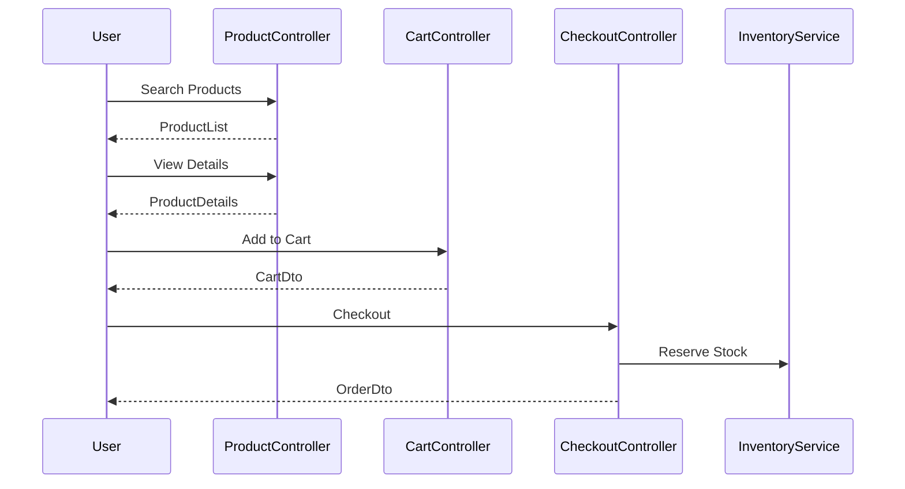

# OnlineShop System Architecture Documentation
**Version:** 1.0  
**Date:** October 2024  
**Language:** English

---

## Table of Contents

1. [System Overview](#system-overview)
2. [Overall Architecture](#overall-architecture)
3. [Project Structure](#project-structure)
4. [Domain Layer](#domain-layer)
5. [Application Layer](#application-layer)
6. [Infrastructure Layer](#infrastructure-layer)
7. [WebAPI Layer](#webapi-layer)
8. [System Flows](#system-flows)
9. [Database Design](#database-design)
10. [API Documentation](#api-documentation)
11. [Testing Strategy](#testing-strategy)
12. [Deployment & Configuration](#deployment--configuration)

---

## System Overview

### Introduction

**OnlineShop** is a comprehensive e-commerce system designed with Clean Architecture and CQRS pattern. It provides complete capabilities for product management, shopping cart, payment processing, order management, and customer interactions.

### System Goals

- **Scalability**: Layered architecture for easy growth
- **Maintainability**: Clear separation of concerns
- **Testability**: Designed for unit and integration testing
- **Security**: Strong authentication with JWT and OTP
- **Integration**: Seamless integration with Mahak ERP system

### Core Features

#### 1. User Management & Authentication
- Traditional registration and login (Email/Password)
- OTP-based authentication
- Phone number login
- Refresh token management
- User roles (Admin, User)

#### 2. Advanced Product Management
- Hierarchical product categorization
- Brands and manufacturers
- Product variants (color, size, model)
- Materials and seasons
- Multiple images with different types (main, gallery, 360°)
- Technical product specifications
- Reviews and ratings
- Related products
- User view tracking

#### 3. Inventory Management
- Multiple inventory based on warehouses
- Automatic stock reservation on order
- Stock alerts
- Stock alert subscription system

#### 4. Shopping Cart & Checkout
- Saved shopping carts
- Automatic price calculation
- Discount codes and coupons
- Multi-step checkout process

#### 5. Order Management
- Order status tracking
- Status change history
- Shipping tracking number
- Estimated delivery time
- SMS and email notifications

#### 6. Return Requests
- Submit return requests
- Admin approval/rejection
- Return status tracking
- Refund processing

#### 7. Mahak Integration
- Data synchronization
- Processing queue
- Sync logs
- Error logs

### Technology Stack

- **Framework**: .NET 8.0
- **ORM**: Entity Framework Core 8.0.21
- **Database**: PostgreSQL
- **Authentication**: ASP.NET Core Identity + JWT
- **Validation**: FluentValidation
- **Mapping**: AutoMapper
- **Mediator**: MediatR
- **Logging**: Serilog
- **SMS Service**: Kavenegar
- **Documentation**: Swagger/OpenAPI

---

## Overall Architecture

### Clean Architecture

OnlineShop is designed based on Clean Architecture introduced by Robert C. Martin (Uncle Bob). This architecture is built on SOLID principles and Separation of Concerns.



### Architecture Layers

#### 1. Domain Layer (System Core)
- **Responsibility**: Define core entities and business rules
- **Dependencies**: No dependencies on other layers
- **Contents**: 
  - Entities (36 entities)
  - Value Objects
  - Enums
  - Domain Interfaces
  - Business Rules

#### 2. Application Layer (Application Logic)
- **Responsibility**: Implement use cases and application logic
- **Dependencies**: Only on Domain layer
- **Contents**:
  - Commands & Queries (CQRS)
  - Command & Query Handlers
  - DTOs (Data Transfer Objects)
  - Validators
  - AutoMapper Profiles
  - Application Interfaces

#### 3. Infrastructure Layer (Infrastructure)
- **Responsibility**: Implement technical details and external resources
- **Dependencies**: On Domain and Application
- **Contents**:
  - Database Context (EF Core)
  - Repository Implementations
  - External Services (SMS, Email)
  - Authentication Services
  - Migrations

#### 4. WebAPI Layer (User Interface)
- **Responsibility**: Provide RESTful APIs
- **Dependencies**: On Application
- **Contents**:
  - Controllers
  - Middlewares
  - Configuration
  - Startup Logic

### CQRS Pattern

The system uses CQRS (Command Query Responsibility Segregation) pattern which separates read and write operations.



#### Commands (Write)
- Create, Update, Delete operations
- State change operations
- Examples: `CreateProductCommand`, `UpdateOrderCommand`

#### Queries (Read)
- Retrieve information
- Search and filter
- Examples: `GetProductByIdQuery`, `SearchProductsQuery`

---

## Project Structure

### Solution Structure

```
OnlineShop.sln
│
├── src/
│   ├── Domain/                      # Domain Layer
│   ├── Application/                 # Application Layer
│   ├── Infrastructure/              # Infrastructure Layer
│   └── WebAPI/                      # API Layer
│
├── tests/
│   ├── OnlineShop.Application.Tests/    # Unit Tests
│   └── OnlineShop.Tests/                # Integration Tests
│
└── documents/                       # Documentation
    ├── Architecture/                # Architecture Docs
    ├── C4Model/                     # C4 Diagrams
    └── Mahak Documentation/         # Mahak Docs
```

### Domain Project Structure

```
src/Domain/
│
├── Common/
│   ├── BaseEntity.cs                # Base class for all entities
│   └── IGenericRepository.cs        # Generic repository interface
│
├── Entities/                        # 36 core entities
│   ├── ApplicationUser.cs           # System user
│   ├── Product.cs                   # Product
│   ├── ProductCategory.cs           # Category
│   ├── Brand.cs                     # Brand
│   ├── ProductVariant.cs            # Product variant
│   ├── Material.cs                  # Material
│   ├── Season.cs                    # Season
│   └── ... (29 more entities)
│
├── Enums/
│   └── OrderStatus.cs               # Order status enum
│
├── Interfaces/
│   └── Repositories/                # Repository interfaces
│       └── ... (32 interfaces)
│
└── OnlineShop.Domain.csproj
```

### Application Project Structure

```
src/Application/
│
├── Common/
│   ├── Behaviors/
│   │   └── ValidationBehavior.cs    # MediatR validation behavior
│   ├── Models/
│   │   ├── Result.cs                # Operation result class
│   │   └── SmsSettings.cs           # SMS settings
│   └── ServiceRegistration.cs       # Service registration
│
├── Contracts/
│   └── Services/
│       ├── ISmsService.cs           # SMS service interface
│       ├── ITokenService.cs         # Token service interface
│       └── IInventoryService.cs     # Inventory service interface
│
├── DTOs/                            # Data Transfer Objects (~90 DTOs)
│   ├── Auth/                        # (12 DTOs)
│   ├── Product/                     # (6 DTOs)
│   ├── Brand/                       # (3 DTOs)
│   └── ... (24 DTO folders)
│
├── Features/                        # Feature-based organization (27 features)
│   ├── Auth/
│   │   ├── Commands/                # Register, Login, SendOtp, etc.
│   │   └── Queries/
│   ├── Product/
│   │   ├── Commands/                # Create, Update, Delete
│   │   └── Queries/                 # GetById, GetAll, Search
│   └── ... (25 more features)
│
├── Mapping/                         # AutoMapper Profiles (28 profiles)
│   ├── ProductProfile.cs
│   ├── BrandProfile.cs
│   └── ...
│
├── Validators/                      # FluentValidation Validators (~55 validators)
│   ├── Auth/
│   ├── Product/
│   └── ...
│
└── OnlineShop.Application.csproj
```

---

## Domain Layer

### BaseEntity

All entities inherit from `BaseEntity`:

```csharp
public abstract class BaseEntity
{
    public Guid Id { get; set; } = Guid.NewGuid();
    public int? MahakId { get; set; }
    public long? MahakClientId { get; set; }
    public long RowVersion { get; set; }
    public bool Deleted { get; set; } = false;
    public DateTime CreatedAt { get; set; } = DateTime.UtcNow;
    public string? CreatedBy { get; set; }
    public DateTime? UpdatedAt { get; set; }
    public string? UpdatedBy { get; set; }
    public DateTime? LastModifiedAt { get; set; }
    public string? LastModifiedBy { get; set; }

    public virtual void Delete(string? deletedBy = null);
}
```

### Core Entities (36 Entities)

#### User Management (5 entities)
1. **ApplicationUser**: System user (Identity)
2. **UserProfile**: Complete user profile
3. **UserAddress**: User addresses
4. **Otp**: One-time password
5. **RefreshToken**: JWT refresh tokens

#### Product Management (14 entities)
6. **Product**: Main product entity
7. **ProductCategory**: Product categories
8. **Brand**: Product brands
9. **Material**: Product materials
10. **Season**: Product seasons
11. **Unit**: Measurement units
12. **ProductVariant**: Product variants (size, color)
13. **ProductImage**: Product images
14. **ProductDetail**: Technical specifications
15. **ProductInventory**: Inventory management
16. **ProductReview**: Customer reviews
17. **ProductRelation**: Related products
18. **ProductMaterial**: Product-Material junction table
19. **ProductSeason**: Product-Season junction table

#### Shopping & Cart (3 entities)
20. **Cart**: Shopping cart
21. **CartItem**: Cart items
22. **SavedCart**: Saved carts

#### Orders & Payments (5 entities)
23. **UserOrder**: Customer order
24. **UserOrderItem**: Order items
25. **UserPayment**: Payments
26. **OrderStatusHistory**: Status history
27. **UserReturnRequest**: Return requests

#### Discounts (2 entities)
28. **Coupon**: Discount coupons
29. **UserCouponUsage**: Coupon usage tracking

#### Others (3 entities)
30. **Wishlist**: Wishlist items
31. **StockAlert**: Stock alerts
32. **UserProductView**: Product view tracking

#### Mahak Integration (4 entities)
33. **MahakMapping**: Entity mappings
34. **MahakQueue**: Sync queue
35. **MahakSyncLog**: Sync logs
36. **SyncErrorLog**: Error logs

---

### Entity Relationships



---


## Application Layer

### Overview

The Application layer contains the system's use cases (business logic) and sits between the Domain layer and external layers (Infrastructure, WebAPI). It only depends on the Domain layer.

### CQRS Pattern

The system fully implements the CQRS pattern, separating operations into two categories:

#### Commands (Write/Modify)
- Create new entities
- Update existing entities
- Delete entities
- Change state

#### Queries (Read)
- Retrieve single entity
- Retrieve list of entities
- Search and filter
- Reports

### Features (27 Features)

Each feature contains its own Commands, Queries, DTOs, and Validators:

#### 1. Auth Feature
**Commands:**
- `RegisterCommand`: User registration
- `LoginCommand`: User login
- `SendOtpCommand`: Send OTP code
- `VerifyOtpCommand`: Verify OTP code
- `RegisterWithPhoneCommand`: Register with phone number
- `LoginWithPhoneCommand`: Login with phone number
- `RefreshTokenCommand`: Refresh JWT token
- `LogoutCommand`: User logout

**DTOs:**
- `RegisterDto`, `LoginDto`
- `SendOtpDto`, `VerifyOtpDto`
- `RegisterWithPhoneDto`, `LoginWithPhoneDto`
- `RefreshTokenDto`, `AuthResponseDto`

**Validators:**
- All DTOs have corresponding validators with business rules

---

#### 2. Product Feature
**Commands:**
- `CreateProductCommand`
- `UpdateProductCommand`
- `DeleteProductCommand`
- `TrackProductViewCommand`

**Queries:**
- `GetProductByIdQuery`: Get product details
- `GetAllProductsQuery`: List all products
- `ProductSearchQuery`: Advanced search
- `GetRelatedProductsQuery`: Related products
- `GetRecentlyViewedQuery`: Recently viewed
- `GetFrequentlyBoughtTogetherQuery`: Frequently bought together

**ProductSearchQuery - Advanced Search:**
```csharp
public class ProductSearchQuery : IRequest<Result<ProductSearchResultDto>>
{
    public string? SearchTerm { get; set; }
    public Guid? CategoryId { get; set; }
    public Guid? BrandId { get; set; }
    public string? Gender { get; set; }
    public List<string>? Sizes { get; set; }
    public List<string>? Colors { get; set; }
    public List<Guid>? MaterialIds { get; set; }
    public List<Guid>? SeasonIds { get; set; }
    public decimal? MinPrice { get; set; }
    public decimal? MaxPrice { get; set; }
    public bool? IsActive { get; set; }
    public bool? IsFeatured { get; set; }
    public bool? InStock { get; set; }
    public bool? OnSale { get; set; }
    public bool? NewArrivals { get; set; }
    public string? SortBy { get; set; }
    public int PageNumber { get; set; } = 1;
    public int PageSize { get; set; } = 20;
}
```

---

#### 3-27. Other Features
- Brand Management
- Material Management
- Season Management
- Product Variants
- Product Categories
- Product Images
- Product Details
- Inventory Management
- Product Reviews
- Cart Management
- Saved Carts
- Checkout Process
- Order Management
- Payment Processing
- Address Management
- User Profiles
- Return Requests
- Wishlists
- Coupon Management
- Stock Alerts
- Unit Management
- Mahak Integration (4 features)

---

### AutoMapper Profiles (28 Profiles)

Each feature has its dedicated profile:

```csharp
public class ProductProfile : Profile
{
    public ProductProfile()
    {
        // Entity to DTO
        CreateMap<Product, ProductDto>()
            .ForMember(d => d.Images, opt => opt.MapFrom(s => s.ProductImages.OrderBy(i => i.DisplayOrder)))
            .ForMember(d => d.Variants, opt => opt.MapFrom(s => s.ProductVariants.OrderBy(v => v.DisplayOrder)))
            .ForMember(d => d.Materials, opt => opt.MapFrom(s => s.ProductMaterials.Select(pm => pm.Material)))
            .ForMember(d => d.Seasons, opt => opt.MapFrom(s => s.ProductSeasons.Select(ps => ps.Season)))
            .ForMember(d => d.ReviewCount, opt => opt.MapFrom(s => s.ProductReviews.Count))
            .ForMember(d => d.AverageRating, opt => opt.MapFrom(s => 
                s.ProductReviews.Any() ? s.ProductReviews.Average(r => r.Rating) : 0));

        // DTO to Entity (with proper ignores)
        CreateMap<CreateProductDto, Product>()
            .ForMember(d => d.Id, opt => opt.Ignore())
            .ForMember(d => d.CategoryId, opt => opt.Ignore())
            // ... other ignored properties
    }
}
```

---

### FluentValidation Validators

Every DTO has a dedicated validator:

```csharp
public class CreateProductDtoValidator : AbstractValidator<CreateProductDto>
{
    public CreateProductDtoValidator()
    {
        RuleFor(x => x.Name)
            .NotEmpty().WithMessage("Product name is required.")
            .MaximumLength(200).WithMessage("Product name must not exceed 200 characters.");

        RuleFor(x => x.Price)
            .GreaterThan(0).WithMessage("Product price must be greater than zero.");

        RuleFor(x => x.StockQuantity)
            .GreaterThanOrEqualTo(0).WithMessage("Stock quantity cannot be negative.");

        RuleFor(x => x.CategoryId)
            .NotEmpty().WithMessage("Product category is required.");
    }
}
```

---

## Infrastructure Layer

### ApplicationDbContext

```csharp
public class ApplicationDbContext : IdentityDbContext<ApplicationUser>
{
    // DbSets for all 36 entities
    public DbSet<Product> Products { get; set; }
    public DbSet<ProductCategory> ProductCategories { get; set; }
    public DbSet<Brand> Brands { get; set; }
    // ... 33 more DbSets

    protected override void OnModelCreating(ModelBuilder modelBuilder)
    {
        base.OnModelCreating(modelBuilder);
        modelBuilder.ApplyConfigurationsFromAssembly(Assembly.GetExecutingAssembly());
    }
}
```

### Repository Pattern

**Example - ProductRepository:**
```csharp
public class ProductRepository : IProductRepository
{
    private readonly ApplicationDbContext _context;

    public async Task<Product?> GetByIdWithIncludesAsync(Guid id, CancellationToken cancellationToken = default)
    {
        return await _context.Products
            .Include(p => p.Category)
            .Include(p => p.Brand)
            .Include(p => p.Unit)
            .Include(p => p.ProductImages.OrderBy(i => i.DisplayOrder))
            .Include(p => p.ProductVariants.OrderBy(v => v.DisplayOrder))
            .Include(p => p.ProductMaterials).ThenInclude(pm => pm.Material)
            .Include(p => p.ProductSeasons).ThenInclude(ps => ps.Season)
            .Include(p => p.ProductReviews.Where(r => r.IsApproved))
            .FirstOrDefaultAsync(p => p.Id == id, cancellationToken);
    }

    // Other methods...
}
```

**Total Repositories:** 32 Implementations

---

### External Services

#### TokenService
JWT and Refresh Token management

#### KavenegarSmsService
Real SMS service integration

#### MockSmsService
Mock SMS service for development

---

## WebAPI Layer

### Controllers (28 Controllers)

Each feature has a dedicated controller:

**Example - ProductController:**
```csharp
[ApiController]
[Route("api/[controller]")]
public class ProductController : ControllerBase
{
    private readonly IMediator _mediator;

    [HttpGet]
    public async Task<IActionResult> GetAll()
    {
        var query = new GetAllProductsQuery();
        var result = await _mediator.Send(query);
        return result.IsSuccess ? Ok(result.Value) : BadRequest(result.ErrorMessage);
    }

    [HttpPost]
    [Authorize(Roles = "Admin")]
    public async Task<IActionResult> Create([FromBody] CreateProductDto dto)
    {
        var command = new CreateProductCommand { Product = dto };
        var result = await _mediator.Send(command);
        return result.IsSuccess
            ? CreatedAtAction(nameof(GetById), new { id = result.Value }, result.Value)
            : BadRequest(result.ErrorMessage);
    }

    // Other endpoints...
}
```

### Middlewares

#### ExceptionHandlingMiddleware
Global exception handling for all requests

#### RequestLoggingMiddleware
Request/response logging

---

## System Flows

### Authentication Flow (OTP-based)



---

### Shopping Flow



---


## Database Design

### Entity Relationship Diagram (Complete)

```mermaid
erDiagram
    ApplicationUser ||--o{ UserOrder : "places"
    ApplicationUser ||--o{ UserAddress : "has"
    ApplicationUser ||--|| UserProfile : "has"
    ApplicationUser ||--o{ Wishlist : "maintains"
    ApplicationUser ||--o{ ProductReview : "writes"
    ApplicationUser ||--o{ Cart : "owns"
    ApplicationUser ||--o{ UserReturnRequest : "submits"

    Product ||--o{ ProductImage : "has"
    Product ||--o{ ProductDetail : "has"
    Product ||--o{ ProductVariant : "has_variant"
    Product ||--o{ ProductInventory : "has_inventory"
    Product ||--o{ ProductReview : "receives"
    Product ||--o{ Wishlist : "in"
    Product ||--o{ CartItem : "in"
    Product ||--o{ UserOrderItem : "in"
    Product }o--|| ProductCategory : "belongs_to"
    Product }o--|| Brand : "from"
    Product }o--|| Unit : "measured_in"
    Product }o--o{ Material : "uses"
    Product }o--o{ Season : "for"

    Cart ||--o{ CartItem : "contains"
    UserOrder ||--o{ UserOrderItem : "contains"
    UserOrder ||--o{ UserPayment : "paid_by"
    UserOrder ||--o{ OrderStatusHistory : "tracks"

    Coupon ||--o{ UserCouponUsage : "used_in"
```



### Main Tables

#### User Tables (5 tables)
- AspNetUsers (Identity)
- UserProfiles
- UserAddresses
- Otps
- RefreshTokens

#### Product Tables (14 tables)
- Products
- ProductCategories
- Brands
- Materials
- Seasons
- Units
- ProductVariants
- ProductImages
- ProductDetails
- ProductInventories
- ProductReviews
- ProductRelations
- ProductMaterials (junction)
- ProductSeasons (junction)

#### Shopping Tables (3 tables)
- Carts
- CartItems
- SavedCarts

#### Order Tables (5 tables)
- UserOrders
- UserOrderItems
- UserPayments
- OrderStatusHistories
- UserReturnRequests

#### Other Tables (9 tables)
- Wishlists
- Coupons
- UserCouponUsages
- StockAlerts
- UserProductViews
- MahakMappings
- MahakQueues
- MahakSyncLogs
- SyncErrorLogs

**Total: 36 Tables**

---

### Key Indexes

```sql
-- Products
CREATE INDEX IX_Products_Name ON Products(Name);
CREATE UNIQUE INDEX IX_Products_Sku ON Products(Sku);
CREATE INDEX IX_Products_CategoryId ON Products(CategoryId);
CREATE INDEX IX_Products_BrandId ON Products(BrandId);
CREATE INDEX IX_Products_IsActive_IsFeatured ON Products(IsActive, IsFeatured);

-- Orders
CREATE INDEX IX_Orders_UserId ON UserOrders(UserId);
CREATE INDEX IX_Orders_OrderNumber ON UserOrders(OrderNumber);
CREATE INDEX IX_Orders_OrderStatus ON UserOrders(OrderStatus);

-- Cart
CREATE INDEX IX_Cart_UserId ON Carts(UserId);

-- OTP
CREATE INDEX IX_Otp_PhoneNumber_IsUsed ON Otps(PhoneNumber, IsUsed);
```

---

## API Documentation

### Base URL
```
Development: https://localhost:5001/api
Production: https://api.onlineshop.com/api
```

### Authentication

All authenticated endpoints require Bearer token:
```
Authorization: Bearer {jwt_token}
```

### Main Endpoints (~140 total)

#### Authentication (8 endpoints)
- `POST /api/auth/register` - Register with email/password
- `POST /api/auth/login` - Login with email/password
- `POST /api/auth/send-otp` - Send OTP code
- `POST /api/auth/verify-otp` - Verify OTP code
- `POST /api/auth/register-phone` - Register with phone number
- `POST /api/auth/login-phone` - Login with phone number
- `POST /api/auth/refresh-token` - Refresh JWT token
- `POST /api/auth/logout` - Logout

#### Products (10+ endpoints)
- `GET /api/product` - List all products
- `GET /api/product/{id}` - Get product details
- `POST /api/product` - Create product (Admin)
- `PUT /api/product/{id}` - Update product (Admin)
- `DELETE /api/product/{id}` - Delete product (Admin)
- `POST /api/product/search` - Advanced search
- `GET /api/product/{id}/related` - Related products
- `GET /api/product/recently-viewed` - Recently viewed
- `POST /api/product/track-view` - Track product view

#### Cart (8 endpoints)
- `GET /api/cart` - Get user cart
- `POST /api/cart/add` - Add to cart
- `PUT /api/cart/update` - Update cart item
- `DELETE /api/cart/remove/{productId}` - Remove from cart
- `POST /api/cart/clear` - Clear cart
- `GET /api/cart/count` - Get items count
- `GET /api/cart/total` - Get cart total

#### Orders (12+ endpoints)
- `GET /api/order` - List orders
- `GET /api/order/{id}` - Get order details
- `POST /api/order` - Create order
- `DELETE /api/order/{id}/cancel` - Cancel order
- `PUT /api/order/{id}/ship` - Ship order (Admin)
- `PUT /api/order/{id}/deliver` - Deliver order (Admin)
- `GET /api/order/{id}/timeline` - Order timeline
- `GET /api/order/tracking/{trackingNumber}` - Track order

#### Reviews (8 endpoints)
- `GET /api/productreview/product/{productId}` - Get product reviews
- `POST /api/productreview` - Create review
- `PUT /api/productreview/{id}` - Update review
- `DELETE /api/productreview/{id}` - Delete review
- `PUT /api/productreview/{id}/approve` - Approve review (Admin)
- `PUT /api/productreview/{id}/reject` - Reject review (Admin)

... and ~100 more endpoints

---

### Request/Response Examples

#### POST /api/product/search

**Request:**
```json
{
  "searchTerm": "shirt",
  "categoryId": "guid",
  "brandId": "guid",
  "gender": "Male",
  "sizes": ["M", "L"],
  "colors": ["Red", "Blue"],
  "minPrice": 100000,
  "maxPrice": 500000,
  "onSale": true,
  "sortBy": "price_asc",
  "pageNumber": 1,
  "pageSize": 20
}
```

**Response (200 OK):**
```json
{
  "products": [
    {
      "id": "guid",
      "name": "Men's T-Shirt",
      "price": 250000,
      "salePrice": 200000,
      "brand": { "name": "Brand A" },
      "images": [{ "imageUrl": "/images/product1.jpg", "isPrimary": true }]
    }
  ],
  "totalCount": 45,
  "totalPages": 3,
  "currentPage": 1,
  "availableSizes": ["S", "M", "L", "XL"],
  "availableColors": ["Red", "Blue", "Green"],
  "priceRange": { "min": 100000, "max": 800000 }
}
```

---

## Testing Strategy

### Unit Tests
- **Framework**: xUnit, Moq, FluentAssertions
- **Coverage**: All Command/Query Handlers, Validators, Domain Methods
- **Current Status**: 158 tests, 146 passing (92.4%)

### Integration Tests
- **Framework**: WebApplicationFactory, In-Memory Database
- **Scenarios**: End-to-end user journeys
- **Target**: 40+ scenarios

---

## System Statistics

### Entities
- **Total**: 36 entities
- **Main Tables**: 34 tables
- **Junction Tables**: 2 tables
- **One-to-Many Relationships**: 45+
- **Many-to-Many Relationships**: 2

### Features & Use Cases
- **Features**: 27 features
- **Commands**: ~95 commands
- **Queries**: ~70 queries
- **Total Use Cases**: ~165

### DTOs & Validation
- **Total DTOs**: ~90
- **Validators**: ~55
- **AutoMapper Profiles**: 28

### API
- **Controllers**: 28
- **Endpoints**: ~140
- **GET**: ~70
- **POST**: ~40
- **PUT**: ~25
- **DELETE**: ~5

### Database
- **Migrations**: 23 migrations
- **Tables**: 36 tables
- **Indexes**: 50+ indexes

---

## Deployment Checklist

- [ ] Set production connection string
- [ ] Configure strong JWT secret
- [ ] Enable HTTPS
- [ ] Configure CORS policy
- [ ] Enable logging
- [ ] Configure SMS service (Kavenegar)
- [ ] Run database migrations
- [ ] Seed roles (Admin, User)
- [ ] Load testing
- [ ] Setup automatic backups

---

## References

### Clean Architecture
- Clean Architecture: A Craftsman's Guide to Software Structure and Design (Robert C. Martin)
- https://blog.cleancoder.com/uncle-bob/2012/08/13/the-clean-architecture.html

### CQRS
- https://martinfowler.com/bliki/CQRS.html
- https://docs.microsoft.com/en-us/azure/architecture/patterns/cqrs

### ASP.NET Core
- https://docs.microsoft.com/en-us/aspnet/core/
- https://docs.microsoft.com/en-us/ef/core/

---

**Prepared by:** OnlineShop Architecture Team  
**Last Updated:** October 2024  
**Document Version:** 1.0


