# مستندات معماری سیستم OnlineShop
**نسخه:** 1.0  
**تاریخ:** مهر ۱۴۰۴  
**زبان:** فارسی

---

## فهرست مطالب

1. [نمای کلی سیستم](#نمای-کلی-سیستم)
2. [معماری کلی](#معماری-کلی)
3. [ساختار پروژه](#ساختار-پروژه)
4. [لایه Domain](#لایه-domain)
5. [لایه Application](#لایه-application)
6. [لایه Infrastructure](#لایه-infrastructure)
7. [لایه WebAPI](#لایه-webapi)
8. [جریان‌های اصلی سیستم](#جریان‌های-اصلی-سیستم)
9. [طراحی دیتابیس](#طراحی-دیتابیس)
10. [مستندات API](#مستندات-api)
11. [استراتژی تست](#استراتژی-تست)
12. [استقرار و پیکربندی](#استقرار-و-پیکربندی)

---

## نمای کلی سیستم

### معرفی

**OnlineShop** یک سیستم فروشگاه آنلاین جامع است که با معماری Clean Architecture و الگوی CQRS طراحی شده است. این سیستم قابلیت‌های کاملی برای مدیریت محصولات، سبد خرید، پرداخت، سفارشات، و تعاملات کاربران را فراهم می‌کند.

### اهداف سیستم

- **مقیاس‌پذیری**: معماری لایه‌بندی شده برای رشد آسان
- **قابلیت نگهداری**: جداسازی واضح مسئولیت‌ها
- **تست‌پذیری**: طراحی برای تست واحد و یکپارچه‌سازی
- **امنیت**: احراز هویت قوی با JWT و OTP
- **یکپارچگی**: ادغام با سیستم Mahak ERP

### قابلیت‌های اصلی

#### 1. مدیریت کاربران و احراز هویت
- ثبت‌نام و ورود سنتی (ایمیل/رمز عبور)
- احراز هویت با OTP (کد یکبار مصرف)
- ورود با شماره تلفن
- مدیریت توکن‌های Refresh
- نقش‌های کاربری (Admin, User)

#### 2. مدیریت محصولات پیشرفته
- دسته‌بندی سلسله‌مراتبی محصولات
- برندها و تولیدکنندگان
- تنوع محصولات (رنگ، سایز، مدل)
- مواد و فصل‌های محصول
- تصاویر چندگانه با انواع مختلف (اصلی، گالری، 360 درجه)
- جزئیات فنی محصولات
- نظرات و امتیازدهی
- محصولات مرتبط
- ردیابی بازدیدهای کاربران

#### 3. مدیریت موجودی
- موجودی چندگانه بر اساس انبار
- رزرو خودکار موجودی هنگام سفارش
- هشدار موجودی
- سیستم اشتراک هشدار موجودی

#### 4. سبد خرید و خرید
- سبدهای خرید ذخیره شده
- محاسبه خودکار قیمت
- کدهای تخفیف و کوپن
- فرآیند پرداخت چندمرحله‌ای

#### 5. مدیریت سفارشات
- ردیابی وضعیت سفارش
- تاریخچه تغییر وضعیت
- شماره پیگیری مرسوله
- تخمین زمان تحویل
- اعلان‌های SMS و ایمیل

#### 6. درخواست‌های مرجوعی
- ثبت درخواست مرجوعی
- تایید/رد توسط ادمین
- ردیابی وضعیت مرجوعی
- استرداد وجه

#### 7. یکپارچگی با Mahak
- همگام‌سازی داده‌ها
- صف پردازش (Queue)
- لاگ همگام‌سازی
- لاگ خطاها

### فناوری‌های استفاده شده

- **Framework**: .NET 8.0
- **ORM**: Entity Framework Core 8.0.21
- **Database**: PostgreSQL
- **Authentication**: ASP.NET Core Identity + JWT
- **Validation**: FluentValidation
- **Mapping**: AutoMapper
- **Mediator**: MediatR
- **Logging**: Serilog
- **SMS Service**: Kavenegar
- **Documentation**: Swagger/OpenAPI

---

## معماری کلی

### Clean Architecture

سیستم OnlineShop بر اساس معماری Clean Architecture (معماری پاک) طراحی شده است که توسط Robert C. Martin (Uncle Bob) معرفی شد. این معماری بر اساس اصول SOLID و جداسازی نگرانی‌ها (Separation of Concerns) است.

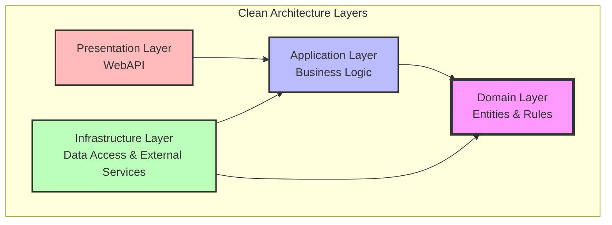

### لایه‌های معماری

#### 1. Domain Layer (هسته سیستم)
- **مسئولیت**: تعریف موجودیت‌های اصلی و قوانین کسب‌وکار
- **وابستگی**: هیچ وابستگی به لایه‌های دیگر ندارد
- **محتوا**: 
  - Entities (36 موجودیت)
  - Value Objects
  - Enums
  - Domain Interfaces
  - Business Rules

#### 2. Application Layer (منطق کاربردی)
- **مسئولیت**: پیاده‌سازی Use Cases و منطق کاربردی
- **وابستگی**: فقط به لایه Domain
- **محتوا**:
  - Commands & Queries (CQRS)
  - Command & Query Handlers
  - DTOs (Data Transfer Objects)
  - Validators
  - AutoMapper Profiles
  - Application Interfaces

#### 3. Infrastructure Layer (زیرساخت)
- **مسئولیت**: پیاده‌سازی جزئیات فنی و ارتباط با منابع خارجی
- **وابستگی**: به Domain و Application
- **محتوا**:
  - Database Context (EF Core)
  - Repository Implementations
  - External Services (SMS, Email)
  - Authentication Services
  - Migrations

#### 4. WebAPI Layer (رابط کاربری)
- **مسئولیت**: ارائه API های RESTful
- **وابستگی**: به Application
- **محتوا**:
  - Controllers
  - Middlewares
  - Configuration
  - Startup Logic

### الگوی CQRS

سیستم از الگوی CQRS (Command Query Responsibility Segregation) استفاده می‌کند که عملیات خواندن و نوشتن را از هم جدا می‌کند.

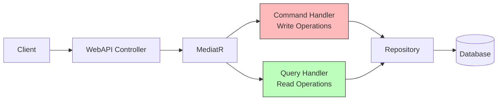

#### Commands (دستورات - نوشتن)
- ایجاد، ویرایش، حذف
- عملیات تغییر وضعیت
- مثال: `CreateProductCommand`, `UpdateOrderCommand`

#### Queries (پرس‌وجو - خواندن)
- دریافت اطلاعات
- جستجو و فیلتر
- مثال: `GetProductByIdQuery`, `SearchProductsQuery`

### اصول SOLID

#### 1. Single Responsibility Principle (SRP)
- هر کلاس فقط یک مسئولیت دارد
- مثال: `ProductRepository` فقط برای دسترسی به داده‌های محصول

#### 2. Open/Closed Principle (OCP)
- باز برای توسعه، بسته برای تغییر
- استفاده از Interfaces برای انعطاف‌پذیری

#### 3. Liskov Substitution Principle (LSP)
- امکان جایگزینی کلاس‌های فرزند با والد
- پیاده‌سازی صحیح Inheritance

#### 4. Interface Segregation Principle (ISP)
- Interfaces کوچک و تخصصی
- مثال: `IProductRepository`, `IOrderRepository`

#### 5. Dependency Inversion Principle (DIP)
- وابستگی به Abstractions نه Implementations
- استفاده گسترده از Dependency Injection

### Dependency Injection

تمام وابستگی‌ها از طریق Constructor Injection تزریق می‌شوند:

```csharp
public class CreateProductCommandHandler : IRequestHandler<CreateProductCommand, Result<Guid>>
{
    private readonly IProductRepository _productRepository;
    private readonly IMapper _mapper;
    private readonly ILogger<CreateProductCommandHandler> _logger;

    public CreateProductCommandHandler(
        IProductRepository productRepository,
        IMapper mapper,
        ILogger<CreateProductCommandHandler> logger)
    {
        _productRepository = productRepository;
        _mapper = mapper;
        _logger = logger;
    }
    
    // Implementation...
}
```

---

## ساختار پروژه

### Solution Structure

```
OnlineShop.sln
│
├── src/
│   ├── Domain/                      # لایه دامین
│   ├── Application/                 # لایه اپلیکیشن
│   ├── Infrastructure/              # لایه زیرساخت
│   └── WebAPI/                      # لایه API
│
├── tests/
│   ├── OnlineShop.Application.Tests/    # تست‌های واحد
│   └── OnlineShop.Tests/                # تست‌های یکپارچه‌سازی
│
└── documents/                       # مستندات
    ├── Architecture/                # مستندات معماری
    ├── C4Model/                     # دیاگرام‌های C4
    └── Mahak Documentation/         # مستندات Mahak
```

### Domain Project Structure

```
src/Domain/
│
├── Common/
│   ├── BaseEntity.cs                # کلاس پایه برای تمام Entity ها
│   └── IGenericRepository.cs        # رابط عمومی Repository
│
├── Entities/                        # 36 موجودیت اصلی
│   ├── ApplicationUser.cs           # کاربر سیستم
│   ├── Product.cs                   # محصول
│   ├── ProductCategory.cs           # دسته‌بندی محصول
│   ├── Brand.cs                     # برند
│   ├── ProductVariant.cs            # تنوع محصول
│   ├── Material.cs                  # جنس محصول
│   ├── Season.cs                    # فصل محصول
│   ├── ProductImage.cs              # تصویر محصول
│   ├── ProductDetail.cs             # جزئیات فنی
│   ├── ProductInventory.cs          # موجودی
│   ├── ProductReview.cs             # نظرات
│   ├── ProductRelation.cs           # محصولات مرتبط
│   ├── Cart.cs                      # سبد خرید
│   ├── CartItem.cs                  # آیتم سبد خرید
│   ├── UserOrder.cs                 # سفارش
│   ├── UserOrderItem.cs             # آیتم سفارش
│   ├── UserPayment.cs               # پرداخت
│   ├── UserAddress.cs               # آدرس کاربر
│   ├── UserProfile.cs               # پروفایل کاربر
│   ├── UserReturnRequest.cs         # درخواست مرجوعی
│   ├── Wishlist.cs                  # لیست علاقه‌مندی
│   ├── SavedCart.cs                 # سبد ذخیره شده
│   ├── Coupon.cs                    # کوپن تخفیف
│   ├── UserCouponUsage.cs           # استفاده از کوپن
│   ├── StockAlert.cs                # هشدار موجودی
│   ├── UserProductView.cs           # بازدید محصول
│   ├── OrderStatusHistory.cs        # تاریخچه وضعیت سفارش
│   ├── Unit.cs                      # واحد اندازه‌گیری
│   ├── Otp.cs                       # کد یکبار مصرف
│   ├── RefreshToken.cs              # توکن تازه‌سازی
│   ├── MahakMapping.cs              # نگاشت Mahak
│   ├── MahakQueue.cs                # صف Mahak
│   ├── MahakSyncLog.cs              # لاگ همگام‌سازی
│   ├── SyncErrorLog.cs              # لاگ خطا
│   ├── ProductMaterial.cs           # جدول واسط محصول-جنس
│   └── ProductSeason.cs             # جدول واسط محصول-فصل
│
├── Enums/
│   └── OrderStatus.cs               # وضعیت سفارش
│
├── Interfaces/
│   └── Repositories/                # رابط‌های Repository
│       ├── IProductRepository.cs
│       ├── IOrderRepository.cs
│       └── ... (32 رابط Repository)
│
└── OnlineShop.Domain.csproj
```

### Application Project Structure

```
src/Application/
│
├── Common/
│   ├── Behaviors/
│   │   └── ValidationBehavior.cs    # رفتار اعتبارسنجی MediatR
│   ├── Models/
│   │   ├── Result.cs                # کلاس نتیجه عملیات
│   │   └── SmsSettings.cs           # تنظیمات SMS
│   └── ServiceRegistration.cs       # ثبت سرویس‌ها
│
├── Contracts/
│   └── Services/
│       ├── ISmsService.cs           # رابط سرویس SMS
│       ├── ITokenService.cs         # رابط سرویس توکن
│       └── IInventoryService.cs     # رابط سرویس موجودی
│
├── DTOs/                            # Data Transfer Objects
│   ├── Auth/                        # (12 DTO)
│   │   ├── LoginDto.cs
│   │   ├── RegisterDto.cs
│   │   ├── SendOtpDto.cs
│   │   ├── VerifyOtpDto.cs
│   │   ├── LoginWithPhoneDto.cs
│   │   ├── RegisterWithPhoneDto.cs
│   │   ├── RefreshTokenDto.cs
│   │   ├── AuthResponseDto.cs
│   │   └── ...
│   ├── Product/                     # (6 DTO)
│   │   ├── ProductDto.cs
│   │   ├── ProductDetailsDto.cs
│   │   ├── CreateProductDto.cs
│   │   ├── UpdateProductDto.cs
│   │   ├── ProductSearchDto.cs
│   │   └── ProductSearchResultDto.cs
│   ├── Brand/                       # (3 DTO)
│   ├── Material/                    # (3 DTO)
│   ├── Season/                      # (3 DTO)
│   ├── ProductVariant/              # (3 DTO)
│   ├── ProductCategory/             # (4 DTO)
│   ├── ProductImage/                # (3 DTO)
│   ├── ProductInventory/            # (3 DTO)
│   ├── Cart/                        # (1 DTO)
│   ├── UserOrder/                   # (4 DTO)
│   ├── UserAddress/                 # (1 DTO)
│   ├── UserProfile/                 # (1 DTO)
│   ├── Coupon/                      # (5 DTO)
│   └── ... (24 پوشه DTO)
│
├── Features/                        # سازماندهی بر اساس Feature
│   ├── Auth/
│   │   ├── Commands/
│   │   │   ├── Register/
│   │   │   │   ├── RegisterCommand.cs
│   │   │   │   └── RegisterCommandHandler.cs
│   │   │   ├── Login/
│   │   │   │   ├── LoginCommand.cs
│   │   │   │   └── LoginCommandHandler.cs
│   │   │   ├── SendOtp/
│   │   │   │   ├── SendOtpCommand.cs
│   │   │   │   └── SendOtpCommandHandler.cs
│   │   │   └── ...
│   │   └── Queries/
│   │       └── ... (در صورت نیاز)
│   │
│   ├── Product/
│   │   ├── Commands/
│   │   │   ├── Create/
│   │   │   │   ├── CreateProductCommand.cs
│   │   │   │   └── CreateProductCommandHandler.cs
│   │   │   ├── Update/
│   │   │   └── Delete/
│   │   └── Queries/
│   │       ├── GetById/
│   │       │   ├── GetProductByIdQuery.cs
│   │       │   └── GetProductByIdQueryHandler.cs
│   │       ├── GetAll/
│   │       └── Search/
│   │           ├── ProductSearchQuery.cs
│   │           └── ProductSearchQueryHandler.cs
│   │
│   └── ... (27 پوشه Feature)
│
├── Mapping/                         # AutoMapper Profiles
│   ├── ProductProfile.cs
│   ├── BrandProfile.cs
│   ├── CartProfile.cs
│   ├── UserOrderProfile.cs
│   └── ... (28 Profile)
│
├── Validators/                      # FluentValidation Validators
│   ├── Auth/
│   │   ├── LoginDtoValidator.cs
│   │   ├── RegisterDtoValidator.cs
│   │   └── ...
│   ├── Product/
│   │   ├── CreateProductDtoValidator.cs
│   │   └── UpdateProductDtoValidator.cs
│   └── ... (24 پوشه Validator)
│
├── Exceptions/
│   └── NotFoundException.cs         # استثنای یافت نشدن
│
├── Services/
│   └── InventoryService.cs          # سرویس مدیریت موجودی
│
└── OnlineShop.Application.csproj
```

### Infrastructure Project Structure

```
src/Infrastructure/
│
├── Data/
│   └── DatabaseSeeder.cs            # مقداردهی اولیه دیتابیس
│
├── DbConfigurations/                # پیکربندی‌های EF Core
│   ├── ProductConfiguration.cs
│   ├── BrandConfiguration.cs
│   ├── UserOrderConfiguration.cs
│   └── ... (28 Configuration)
│
├── Migrations/                      # Migration های EF Core
│   ├── 20250816_InitialCreate.cs
│   ├── 20250822_AddOtpEntity.cs
│   ├── 20250825_EnhancedProducts.cs
│   └── ... (23 Migration)
│
├── Persistence/
│   ├── ApplicationDbContext.cs      # DbContext اصلی
│   ├── ApplicationDbContextFactory.cs
│   ├── OtpRepository.cs
│   └── Repositories/                # پیاده‌سازی Repository ها
│       ├── ProductRepository.cs
│       ├── OrderRepository.cs
│       ├── BrandRepository.cs
│       └── ... (32 Repository)
│
├── Services/
│   ├── TokenService.cs              # سرویس مدیریت توکن
│   ├── KavenegarSmsService.cs       # سرویس SMS واقعی
│   └── MockSmsService.cs            # سرویس SMS تستی
│
├── ServiceRegistration.cs           # ثبت سرویس‌های Infrastructure
│
└── OnlineShop.Infrastructure.csproj
```

### WebAPI Project Structure

```
src/WebAPI/
│
├── Controllers/                     # API Controllers
│   ├── AuthController.cs
│   ├── ProductController.cs
│   ├── BrandController.cs
│   ├── CartController.cs
│   ├── CheckoutController.cs
│   ├── UserOrderController.cs
│   ├── OrderTrackingController.cs
│   └── ... (28 Controller)
│
├── Middlewares/
│   ├── ExceptionHandlingMiddleware.cs   # میان‌افزار مدیریت خطا
│   └── RequestLoggingMiddleware.cs      # میان‌افزار لاگ
│
├── Properties/
│   └── launchSettings.json          # تنظیمات اجرا
│
├── appsettings.json                 # تنظیمات اصلی
├── appsettings.Development.json     # تنظیمات توسعه
├── Program.cs                       # نقطه ورود برنامه
│
└── OnlineShop.WebAPI.csproj
```

### Dependencies و NuGet Packages

#### Domain Project
```xml
<ItemGroup>
  <PackageReference Include="Microsoft.AspNetCore.Identity.EntityFrameworkCore" Version="8.0.8" />
</ItemGroup>
```

#### Application Project  
```xml
<ItemGroup>
  <PackageReference Include="AutoMapper" Version="13.0.1" />
  <PackageReference Include="FluentValidation" Version="11.9.2" />
  <PackageReference Include="FluentValidation.DependencyInjectionExtensions" Version="11.9.2" />
  <PackageReference Include="MediatR" Version="12.4.0" />
  <PackageReference Include="Microsoft.EntityFrameworkCore" Version="8.0.21" />
</ItemGroup>

<ItemGroup>
  <ProjectReference Include="..\Domain\OnlineShop.Domain.csproj" />
</ItemGroup>
```

#### Infrastructure Project
```xml
<ItemGroup>
  <PackageReference Include="Microsoft.AspNetCore.Authentication.JwtBearer" Version="8.0.8" />
  <PackageReference Include="Microsoft.AspNetCore.Identity.EntityFrameworkCore" Version="8.0.8" />
  <PackageReference Include="Microsoft.EntityFrameworkCore" Version="8.0.21" />
  <PackageReference Include="Microsoft.EntityFrameworkCore.Design" Version="8.0.21" />
  <PackageReference Include="Microsoft.EntityFrameworkCore.Tools" Version="8.0.21" />
  <PackageReference Include="Npgsql.EntityFrameworkCore.PostgreSQL" Version="8.0.21" />
  <PackageReference Include="Serilog.AspNetCore" Version="8.0.2" />
  <PackageReference Include="Serilog.Sinks.PostgreSQL" Version="2.3.0" />
</ItemGroup>

<ItemGroup>
  <ProjectReference Include="..\Domain\OnlineShop.Domain.csproj" />
  <ProjectReference Include="..\Application\OnlineShop.Application.csproj" />
</ItemGroup>
```

#### WebAPI Project
```xml
<ItemGroup>
  <PackageReference Include="Microsoft.AspNetCore.OpenApi" Version="8.0.8" />
  <PackageReference Include="Microsoft.EntityFrameworkCore.Design" Version="8.0.21" />
  <PackageReference Include="Serilog.AspNetCore" Version="8.0.2" />
  <PackageReference Include="Serilog.Sinks.File" Version="6.0.0" />
  <PackageReference Include="Swashbuckle.AspNetCore" Version="6.4.0" />
</ItemGroup>

<ItemGroup>
  <ProjectReference Include="..\Application\OnlineShop.Application.csproj" />
  <ProjectReference Include="..\Infrastructure\OnlineShop.Infrastructure.csproj" />
</ItemGroup>
```

### دیاگرام وابستگی‌های پروژه

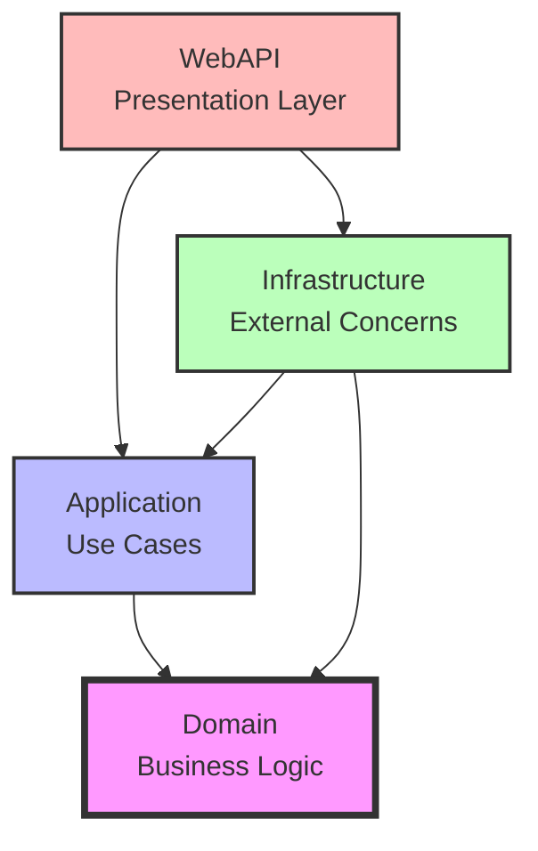

**نکات مهم وابستگی:**
1. Domain هیچ وابستگی به لایه‌های دیگر ندارد
2. Application فقط به Domain وابسته است
3. Infrastructure به Domain و Application وابسته است
4. WebAPI به Application و Infrastructure وابسته است
5. تمام interfaces در Domain و Application تعریف می‌شوند
6. پیاده‌سازی‌ها در Infrastructure قرار دارند

---


## لایه Domain

### معرفی

لایه Domain هسته اصلی سیستم است که شامل منطق کسب‌وکار و قوانین اصلی برنامه می‌باشد. این لایه مستقل از هرگونه تکنولوژی خاص بوده و هیچ وابستگی به لایه‌های دیگر ندارد.

### BaseEntity - کلاس پایه

تمام Entity های سیستم از `BaseEntity` ارث‌بری می‌کنند:

```csharp
public abstract class BaseEntity
{
    public Guid Id { get; set; } = Guid.NewGuid();
    public int? MahakId { get; set; }
    public long? MahakClientId { get; set; }
    public long RowVersion { get; set; }
    public bool Deleted { get; set; } = false;
    public DateTime CreatedAt { get; set; } = DateTime.UtcNow;
    public string? CreatedBy { get; set; }
    public DateTime? UpdatedAt { get; set; }
    public string? UpdatedBy { get; set; }
    public DateTime? LastModifiedAt { get; set; }
    public string? LastModifiedBy { get; set; }

    public virtual void Delete(string? deletedBy = null);
}
```

**ویژگی‌های مشترک:**
- `Id`: شناسه منحصر به فرد (GUID)
- `MahakId`, `MahakClientId`: برای یکپارچگی با Mahak
- `RowVersion`: برای Optimistic Concurrency
- `Deleted`: برای Soft Delete
- `CreatedAt`, `CreatedBy`: زمان و کاربر ایجاد
- `UpdatedAt`, `UpdatedBy`: زمان و کاربر آخرین ویرایش
- `LastModifiedAt`, `LastModifiedBy`: آخرین تغییر

### موجودیت‌های اصلی (Entities)

سیستم دارای 36 موجودیت اصلی است که در 9 دسته طبقه‌بندی می‌شوند:

#### 1. مدیریت کاربران (User Management)

##### ApplicationUser
کاربر سیستم که از `IdentityUser` ارث‌بری می‌کند.

**ویژگی‌های اصلی:**
- `UserName`: نام کاربری
- `Email`: ایمیل
- `PhoneNumber`: شماره تلفن
- `FirstName`, `LastName`: نام و نام خانوادگی
- `EmailConfirmed`, `PhoneNumberConfirmed`: تایید ایمیل/تلفن

**روابط:**
- یک کاربر می‌تواند چندین سفارش داشته باشد
- یک کاربر می‌تواند چندین آدرس داشته باشد
- یک کاربر یک پروفایل دارد

##### UserProfile
پروفایل کامل کاربر.

**ویژگی‌های اصلی:**
- `UserId`: شناسه کاربر
- `FirstName`, `LastName`: نام کامل
- `PhoneNumber`: تلفن
- `BirthDate`: تاریخ تولد
- `Gender`: جنسیت
- `AvatarUrl`: تصویر پروفایل
- `IsEmailVerified`, `IsPhoneVerified`: وضعیت تایید
- `EmailVerifiedAt`, `PhoneVerifiedAt`: زمان تایید

**متدهای اصلی:**
```csharp
public static UserProfile Create(Guid userId, string firstName, string lastName)
public void Update(string firstName, string lastName, string phoneNumber, ...)
public void VerifyEmail()
public void VerifyPhone()
```

##### UserAddress
آدرس‌های کاربر.

**ویژگی‌های اصلی:**
- `UserId`: شناسه کاربر
- `Title`: عنوان آدرس (منزل، محل کار، ...)
- `FirstName`, `LastName`: گیرنده
- `AddressLine1`, `AddressLine2`: خط آدرس
- `City`: شهر
- `State`: استان
- `PostalCode`: کد پستی
- `Country`: کشور
- `PhoneNumber`: تلفن
- `IsDefault`: آدرس پیش‌فرض

**متدهای اصلی:**
```csharp
public static UserAddress Create(Guid userId, string title, ...)
public void Update(string title, string addressLine1, ...)
public void SetAsDefault()
public void UnsetAsDefault()
```

##### Otp
کد یکبار مصرف برای احراز هویت.

**ویژگی‌های اصلی:**
- `PhoneNumber`: شماره تلفن
- `Code`: کد 6 رقمی
- `ExpiresAt`: زمان انقضا (5 دقیقه)
- `IsUsed`: استفاده شده یا خیر
- `Purpose`: هدف (Login, Register, ...)

**متدهای اصلی:**
```csharp
public static Otp Create(string phoneNumber, string purpose)
public void MarkAsUsed()
public bool IsValid() // بررسی اعتبار و عدم انقضا
```

##### RefreshToken
توکن تازه‌سازی JWT.

**ویژگی‌های اصلی:**
- `UserId`: شناسه کاربر
- `Token`: رشته توکن
- `ExpiresAt`: زمان انقضا
- `IsRevoked`: لغو شده یا خیر
- `RevokedAt`: زمان لغو

---

#### 2. مدیریت محصولات (Product Management)

##### Product
موجودیت اصلی محصول.

**ویژگی‌های اصلی:**
- `Name`: نام محصول
- `Description`: توضیحات
- `Price`: قیمت
- `StockQuantity`: تعداد موجودی
- `CategoryId`: شناسه دسته‌بندی
- `UnitId`: شناسه واحد
- `BrandId`: شناسه برند
- `Gender`: جنسیت (Male/Female/Kids/Unisex)
- `Sku`: کد SKU
- `Barcode`: بارکد
- `Weight`: وزن
- `Dimensions`: ابعاد
- `IsActive`: فعال
- `IsFeatured`: ویژه
- `ViewCount`: تعداد بازدید
- `SalePrice`: قیمت حراج
- `SaleStartDate`, `SaleEndDate`: تاریخ شروع/پایان حراج

**روابط:**
- یک محصول در یک دسته‌بندی قرار دارد
- یک محصول یک واحد دارد
- یک محصول یک برند دارد
- یک محصول چندین تصویر دارد
- یک محصول چندین تنوع (Variant) دارد
- یک محصول چندین جنس (Material) دارد
- یک محصول چندین فصل (Season) دارد

**متدهای اصلی:**
```csharp
public static Product Create(string name, string description, decimal price, ...)
public void Update(string name, string description, decimal price, ...)
public void SetPrice(decimal price)
public void SetName(string name)
public void SetBrandId(Guid? brandId)
public void SetGender(string? gender)
public void SetSalePrice(decimal? salePrice)
public void SetSaleDates(DateTime? start, DateTime? end)
public void Activate()
public void Deactivate()
public void SetAsFeatured()
public void RemoveFromFeatured()
public void IncrementViewCount()
public decimal GetCurrentPrice() // قیمت فعلی (با حراج)
public bool IsOnSale() // در حراج است یا خیر
```

##### ProductCategory
دسته‌بندی محصولات.

**ویژگی‌های اصلی:**
- `Name`: نام دسته
- `Description`: توضیحات
- `ParentCategoryId`: دسته والد (برای ساختار درختی)
- `ImageUrl`: تصویر دسته
- `DisplayOrder`: ترتیب نمایش
- `IsActive`: فعال

**متدهای اصلی:**
```csharp
public static ProductCategory Create(string name, ...)
public void Update(string name, string description)
public void SetName(string name)
public void SetDescription(string description)
```

##### Brand
برند محصولات.

**ویژگی‌های اصلی:**
- `Name`: نام برند
- `LogoUrl`: لوگو
- `Description`: توضیحات
- `IsActive`: فعال

**متدهای اصلی:**
```csharp
public static Brand Create(string name, string? logoUrl, string? description)
public void Update(string name, string? logoUrl, string? description)
public void Activate()
public void Deactivate()
```

##### ProductVariant
تنوع محصول (رنگ، سایز، مدل).

**ویژگی‌های اصلی:**
- `ProductId`: شناسه محصول
- `Size`: سایز
- `Color`: رنگ
- `SKU`: کد منحصر به فرد
- `StockQuantity`: موجودی این تنوع
- `AdditionalPrice`: قیمت اضافی
- `IsAvailable`: موجود
- `DisplayOrder`: ترتیب نمایش

**متدهای اصلی:**
```csharp
public static ProductVariant Create(Guid productId, string? size, string? color, ...)
public void Update(string? size, string? color, string sku, ...)
public void SetStockQuantity(int quantity)
public void SetAvailability(bool isAvailable)
```

##### Material
جنس محصول.

**ویژگی‌های اصلی:**
- `Name`: نام جنس (پنبه، پشم، پلی‌استر، ...)
- `Description`: توضیحات
- `IsActive`: فعال

**متدهای اصلی:**
```csharp
public static Material Create(string name, string? description)
public void Update(string name, string? description)
```

##### Season
فصل محصول.

**ویژگی‌های اصلی:**
- `Name`: نام فصل (بهار، تابستان، پاییز، زمستان، چهارفصل)
- `IsActive`: فعال

**متدهای اصلی:**
```csharp
public static Season Create(string name)
public void Update(string name)
```

##### ProductMaterial (جدول واسط)
رابطه Many-to-Many بین Product و Material.

**ویژگی‌ها:**
- `ProductId`: شناسه محصول
- `MaterialId`: شناسه جنس

##### ProductSeason (جدول واسط)
رابطه Many-to-Many بین Product و Season.

**ویژگی‌ها:**
- `ProductId`: شناسه محصول
- `SeasonId`: شناسه فصل

##### ProductImage
تصاویر محصول.

**ویژگی‌های اصلی:**
- `ProductId`: شناسه محصول
- `ImageUrl`: آدرس تصویر
- `AltText`: متن جایگزین
- `Title`: عنوان
- `DisplayOrder`: ترتیب نمایش
- `IsPrimary`: تصویر اصلی
- `ImageType`: نوع تصویر (Main, Hover, Gallery, 360, Video)
- `FileSize`: حجم فایل
- `MimeType`: نوع فایل

**متدهای اصلی:**
```csharp
public static ProductImage Create(Guid productId, string imageUrl, ...)
public void Update(string imageUrl, string? altText, ...)
public void SetAsPrimary()
public void SetDisplayOrder(int order)
```

##### ProductDetail
جزئیات فنی محصول.

**ویژگی‌های اصلی:**
- `ProductId`: شناسه محصول
- `Key`: کلید (مثلاً "جنس", "رنگ", ...)
- `Value`: مقدار
- `Description`: توضیحات
- `DisplayOrder`: ترتیب نمایش

**متدهای اصلی:**
```csharp
public static ProductDetail Create(Guid productId, string key, string value, ...)
public void Update(string key, string value, ...)
```

##### ProductRelation
محصولات مرتبط.

**ویژگی‌های اصلی:**
- `ProductId`: محصول اصلی
- `RelatedProductId`: محصول مرتبط
- `RelationType`: نوع رابطه (Related, Similar, Alternative, Accessory)
- `DisplayOrder`: ترتیب نمایش
- `IsActive`: فعال

**متدهای اصلی:**
```csharp
public static ProductRelation Create(Guid productId, Guid relatedProductId, ...)
public void Update(string relationType, int displayOrder)
```

##### Unit
واحد اندازه‌گیری.

**ویژگی‌های اصلی:**
- `Name`: نام واحد (عدد، کیلوگرم، متر، ...)
- `Symbol`: نماد (kg, m, ...)
- `IsActive`: فعال

**متدهای اصلی:**
```csharp
public static Unit Create(string name, string? symbol)
public void Update(string name, string? symbol)
```

---

#### 3. مدیریت موجودی (Inventory Management)

##### ProductInventory
موجودی محصولات.

**ویژگی‌های اصلی:**
- `ProductId`: شناسه محصول
- `AvailableQuantity`: تعداد موجود
- `ReservedQuantity`: تعداد رزرو شده
- `SoldQuantity`: تعداد فروخته شده
- `Location`: محل انبار
- `LastSyncAt`: آخرین همگام‌سازی با Mahak
- `SyncStatus`: وضعیت همگام‌سازی
- `SyncError`: خطای همگام‌سازی

**متدهای اصلی:**
```csharp
public static ProductInventory Create(Guid productId, int availableQuantity, ...)
public void SetAvailableQuantity(int quantity)
public void AddStock(int quantity)
public void ReserveQuantity(int quantity)
public void ReleaseReservedQuantity(int quantity)
public void CommitSale(int quantity)
public int GetAvailableStock()
public int GetTotalQuantity()
```

##### StockAlert
هشدار موجودی.

**ویژگی‌های اصلی:**
- `ProductId`: شناسه محصول
- `UserId`: شناسه کاربر
- `Email`: ایمیل
- `PhoneNumber`: تلفن
- `IsNotified`: اعلان داده شده
- `NotifiedAt`: زمان اعلان
- `IsActive`: فعال

**متدهای اصلی:**
```csharp
public static StockAlert Create(Guid productId, Guid userId, ...)
public void MarkAsNotified()
public void Deactivate()
```

---

#### 4. نظرات و امتیازدهی (Reviews & Ratings)

##### ProductReview
نظرات کاربران درباره محصولات.

**ویژگی‌های اصلی:**
- `ProductId`: شناسه محصول
- `UserId`: شناسه کاربر
- `Title`: عنوان نظر
- `Comment`: متن نظر
- `Rating`: امتیاز (1-5)
- `IsVerified`: تایید شده (خرید انجام شده)
- `IsApproved`: تایید ادمین
- `ApprovedAt`, `ApprovedBy`: زمان و کاربر تایید
- `AdminNotes`: یادداشت ادمین
- `RejectedAt`, `RejectedBy`: زمان و کاربر رد
- `RejectionReason`: دلیل رد

**متدهای اصلی:**
```csharp
public static ProductReview Create(Guid productId, Guid userId, string title, ...)
public void Update(string title, string comment, int rating)
public void MarkAsVerified()
public void Approve(string? adminNotes = null)
public void Reject(string rejectionReason, string? adminNotes = null)
```

---

#### 5. سبد خرید (Shopping Cart)

##### Cart
سبد خرید کاربر.

**ویژگی‌های اصلی:**
- `UserId`: شناسه کاربر
- `SessionId`: شناسه نشست (برای کاربران مهمان)
- `CartName`: نام سبد
- `IsActive`: فعال
- `ExpiresAt`: زمان انقضا

**روابط:**
- یک سبد چندین آیتم دارد

**متدهای اصلی:**
```csharp
public static Cart Create(Guid userId, string sessionId, ...)
public void Activate()
public void Deactivate()
public void SetExpiresAt(DateTime? expiresAt)
public bool IsExpired()
```

##### CartItem
آیتم‌های سبد خرید.

**ویژگی‌های اصلی:**
- `CartId`: شناسه سبد
- `ProductId`: شناسه محصول
- `Quantity`: تعداد
- `UnitPrice`: قیمت واحد
- `TotalPrice`: قیمت کل

**متدهای اصلی:**
```csharp
public static CartItem Create(Guid cartId, Guid productId, int quantity, ...)
public void SetQuantity(int quantity)
public void UpdatePrice(decimal unitPrice)
```

##### SavedCart
سبدهای خرید ذخیره شده.

**ویژگی‌های اصلی:**
- `UserId`: شناسه کاربر
- `CartId`: شناسه سبد
- `SavedAt`: زمان ذخیره
- `LastAccessedAt`: آخرین دسترسی
- `AccessCount`: تعداد دسترسی

**متدهای اصلی:**
```csharp
public static SavedCart Create(Guid userId, Guid cartId, string name)
public void UpdateLastAccessed()
```

---

#### 6. سفارشات و پرداخت (Orders & Payments)

##### UserOrder
سفارش کاربر.

**ویژگی‌های اصلی:**
- `UserId`: شناسه کاربر
- `OrderNumber`: شماره سفارش (منحصر به فرد)
- `OrderStatus`: وضعیت (Pending, Processing, Shipped, Delivered, Cancelled)
- `SubTotal`: مجموع قبل از تخفیف
- `TaxAmount`: مالیات
- `ShippingAmount`: هزینه ارسال
- `DiscountAmount`: تخفیف
- `TotalAmount`: مجموع نهایی
- `Currency`: واحد پول (IRR)
- `Notes`: یادداشت
- `ShippedAt`, `DeliveredAt`, `CancelledAt`: زمان‌های مختلف
- `CancellationReason`: دلیل لغو
- `TrackingNumber`: شماره پیگیری
- `EstimatedDeliveryDate`: تاریخ تخمینی تحویل
- `ActualDeliveryDate`: تاریخ واقعی تحویل
- `ShippingAddressId`, `BillingAddressId`: آدرس ارسال و صورتحساب

**متدهای اصلی:**
```csharp
public static UserOrder Create(Guid userId, string orderNumber, ...)
public void Update(decimal subTotal, decimal taxAmount, ...)
public void StartProcessing()
public void MarkAsShipped(string trackingNumber, DateTime? estimatedDelivery)
public void MarkAsDelivered()
public void Cancel(string reason)
public void SetTrackingNumber(string trackingNumber)
public void SetShippingAddress(Guid addressId)
public void SetBillingAddress(Guid addressId)
```

##### UserOrderItem
آیتم‌های سفارش.

**ویژگی‌های اصلی:**
- `OrderId`: شناسه سفارش
- `ProductId`: شناسه محصول
- `ProductName`: نام محصول (ذخیره برای تاریخچه)
- `Quantity`: تعداد
- `UnitPrice`: قیمت واحد
- `TotalPrice`: قیمت کل
- `DiscountAmount`: تخفیف
- `FinalPrice`: قیمت نهایی

**متدهای اصلی:**
```csharp
public static UserOrderItem Create(Guid orderId, Guid productId, ...)
public void Update(int quantity, decimal unitPrice, ...)
```

##### OrderStatusHistory
تاریخچه تغییر وضعیت سفارش.

**ویژگی‌های اصلی:**
- `OrderId`: شناسه سفارش
- `Status`: وضعیت جدید
- `Notes`: یادداشت
- `ChangedBy`: تغییر داده شده توسط
- `ChangedAt`: زمان تغییر

**متدهای اصلی:**
```csharp
public static OrderStatusHistory Create(Guid orderId, string status, ...)
```

##### UserPayment
پرداخت کاربر.

**ویژگی‌های اصلی:**
- `UserId`: شناسه کاربر
- `OrderId`: شناسه سفارش
- `Amount`: مبلغ
- `PaymentMethod`: روش پرداخت
- `PaymentStatus`: وضعیت (Pending, Paid, Failed, Refunded)
- `TransactionId`: شناسه تراکنش
- `GatewayResponse`: پاسخ درگاه
- `PaidAt`: زمان پرداخت
- `FailedAt`: زمان خطا
- `FailureReason`: دلیل خطا
- `RefundId`, `RefundAmount`, `RefundedAt`, `RefundReason`: اطلاعات استرداد

**متدهای اصلی:**
```csharp
public static UserPayment Create(Guid userId, Guid orderId, decimal amount, ...)
public void MarkAsPaid(string transactionId, string gatewayResponse)
public void MarkAsFailed(string failureReason)
public void Refund(decimal refundAmount, string refundReason)
```

---

#### 7. مرجوعی (Returns)

##### UserReturnRequest
درخواست مرجوعی کاربر.

**ویژگی‌های اصلی:**
- `UserId`: شناسه کاربر
- `OrderId`: شناسه سفارش
- `OrderItemId`: شناسه آیتم سفارش
- `ReturnReason`: دلیل مرجوعی
- `ReturnQuantity`: تعداد
- `RefundAmount`: مبلغ استرداد
- `ReturnStatus`: وضعیت (Pending, Approved, Rejected, Processed)
- `AdminNotes`: یادداشت ادمین
- `ApprovedAt`, `ApprovedBy`: تایید
- `RejectedAt`, `RejectedBy`, `RejectionReason`: رد
- `ProcessedAt`, `ProcessedBy`: پردازش

**متدهای اصلی:**
```csharp
public static UserReturnRequest Create(Guid userId, Guid orderId, ...)
public void Update(string returnReason, int returnQuantity, ...)
public void Approve(string? adminNotes = null)
public void Reject(string rejectionReason, string? adminNotes = null)
public void MarkAsProcessed(string? notes = null)
```

---

#### 8. کوپن و تخفیف (Coupons & Discounts)

##### Coupon
کوپن تخفیف.

**ویژگی‌های اصلی:**
- `Code`: کد کوپن (منحصر به فرد)
- `Description`: توضیحات
- `DiscountType`: نوع تخفیف (Percentage, FixedAmount)
- `DiscountValue`: مقدار تخفیف
- `MinimumPurchase`: حداقل خرید
- `MaximumDiscount`: حداکثر تخفیف
- `UsageLimit`: محدودیت استفاده کل
- `UsagePerUser`: محدودیت هر کاربر
- `UsedCount`: تعداد استفاده
- `StartDate`, `EndDate`: تاریخ شروع و پایان
- `IsActive`: فعال

**متدهای اصلی:**
```csharp
public static Coupon Create(string code, string description, ...)
public void Update(string description, string discountType, ...)
public void Activate()
public void Deactivate()
public bool IsValid()
public void IncrementUsedCount()
public decimal CalculateDiscount(decimal purchaseAmount)
```

##### UserCouponUsage
استفاده کاربران از کوپن.

**ویژگی‌های اصلی:**
- `UserId`: شناسه کاربر
- `CouponId`: شناسه کوپن
- `OrderId`: شناسه سفارش
- `DiscountAmount`: مبلغ تخفیف
- `UsedAt`: زمان استفاده

**متدهای اصلی:**
```csharp
public static UserCouponUsage Create(Guid userId, Guid couponId, ...)
```

---

#### 9. سایر موجودیت‌ها (Others)

##### Wishlist
لیست علاقه‌مندی‌های کاربر.

**ویژگی‌های اصلی:**
- `UserId`: شناسه کاربر
- `ProductId`: شناسه محصول
- `AddedAt`: زمان افزودن
- `Notes`: یادداشت

**متدهای اصلی:**
```csharp
public static Wishlist Create(Guid userId, Guid productId, string? notes)
public void UpdateNotes(string? notes)
```

##### UserProductView
ردیابی بازدید محصولات توسط کاربران.

**ویژگی‌های اصلی:**
- `UserId`: شناسه کاربر
- `ProductId`: شناسه محصول
- `ViewedAt`: زمان بازدید
- `ViewDuration`: مدت زمان بازدید (ثانیه)
- `IsReturningView`: بازدید مجدد

**متدهای اصلی:**
```csharp
public static UserProductView Create(Guid userId, Guid productId)
public void UpdateDuration(int seconds)
```

##### MahakMapping
نگاشت موجودیت‌های محلی با Mahak.

**ویژگی‌های اصلی:**
- `EntityType`: نوع موجودیت (Product, Order, ...)
- `LocalEntityId`: شناسه محلی
- `MappingStatus`: وضعیت نگاشت
- `MappedAt`: زمان نگاشت
- `UnmappedAt`, `UnmappedReason`: حذف نگاشت

**متدهای اصلی:**
```csharp
public static MahakMapping Create(string entityType, Guid localEntityId)
public void Map()
public void Unmap(string reason)
```

##### MahakQueue
صف همگام‌سازی با Mahak.

**ویژگی‌های اصلی:**
- `EntityId`: شناسه موجودیت
- `QueueStatus`: وضعیت (Pending, Processing, Completed, Failed)
- `RetryCount`: تعداد تلاش مجدد
- `MaxRetries`: حداکثر تلاش
- `ScheduledAt`: زمان برنامه‌ریزی
- `ProcessedAt`: زمان پردازش
- `FailedAt`: زمان خطا
- `ErrorMessage`: پیام خطا
- `MahakResponse`: پاسخ Mahak
- `NextRetryAt`: زمان تلاش بعدی

**متدهای اصلی:**
```csharp
public static MahakQueue Create(Guid entityId, DateTime scheduledAt, ...)
public void MarkAsProcessing()
public void MarkAsCompleted(string mahakResponse)
public void MarkAsFailed(string errorMessage)
public void ScheduleRetry()
```

##### MahakSyncLog
لاگ همگام‌سازی با Mahak.

**ویژگی‌های اصلی:**
- `EntityId`: شناسه موجودیت
- `SyncStartedAt`: زمان شروع
- `SyncCompletedAt`: زمان پایان
- `DurationMs`: مدت زمان (میلی‌ثانیه)
- `RecordsSuccessful`: تعداد موفق
- `RecordsFailed`: تعداد ناموفق
- `ErrorMessage`: پیام خطا
- `SyncData`: داده‌های همگام‌سازی
- `MahakResponse`: پاسخ Mahak

**متدهای اصلی:**
```csharp
public static MahakSyncLog Create(Guid entityId)
public void Complete(int successCount, int failedCount, string? errorMessage)
```

##### SyncErrorLog
لاگ خطاهای همگام‌سازی.

**ویژگی‌های اصلی:**
- `EntityId`: شناسه موجودیت
- `ErrorMessage`: پیام خطا
- `StackTrace`: Stack Trace
- `RequestData`: داده‌های درخواست
- `ResponseData`: داده‌های پاسخ
- `IsResolved`: حل شده
- `ResolvedAt`, `ResolvedBy`, `ResolutionNotes`: اطلاعات حل
- `OccurrenceCount`: تعداد رخداد
- `LastOccurredAt`: آخرین رخداد

**متدهای اصلی:**
```csharp
public static SyncErrorLog Create(Guid entityId, string errorMessage, ...)
public void Resolve(string resolvedBy, string resolutionNotes)
public void IncrementOccurrence()
```

---

### روابط بین Entity ها

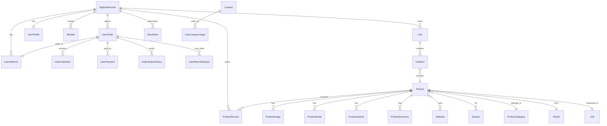

---

### Enums

#### OrderStatus
```csharp
public enum OrderStatus
{
    Pending,        // در انتظار
    Processing,     // در حال پردازش
    Packed,         // بسته‌بندی شده
    Shipped,        // ارسال شده
    OutForDelivery, // در حال تحویل
    Delivered,      // تحویل داده شده
    Cancelled,      // لغو شده
    Returned        // مرجوع شده
}
```

---

### Interfaces

#### IGenericRepository<T>
رابط عمومی برای تمام Repository ها:

```csharp
public interface IGenericRepository<T> where T : BaseEntity
{
    Task<T?> GetByIdAsync(Guid id, CancellationToken cancellationToken = default);
    Task<IEnumerable<T>> GetAllAsync(CancellationToken cancellationToken = default);
    Task<T> AddAsync(T entity, CancellationToken cancellationToken = default);
    Task UpdateAsync(T entity, CancellationToken cancellationToken = default);
    Task DeleteAsync(Guid id, CancellationToken cancellationToken = default);
}
```

#### Repository Interfaces
برای هر Entity یک Interface مخصوص وجود دارد:

- `IProductRepository`
- `IOrderRepository`
- `IBrandRepository`
- `ICartRepository`
- `ICouponRepository`
- ... (32 رابط)

**مثال IProductRepository:**
```csharp
public interface IProductRepository : IGenericRepository<Product>
{
    Task<Product?> GetByIdWithIncludesAsync(Guid id, CancellationToken cancellationToken = default);
    Task<IEnumerable<Product>> GetAllWithIncludesAsync(CancellationToken cancellationToken = default);
    Task<IEnumerable<Product>> SearchAsync(ProductSearchDto searchDto, CancellationToken cancellationToken = default);
    Task<bool> ExistsBySkuAsync(string sku, CancellationToken cancellationToken = default);
}
```

---


## لایه Application

### معرفی

لایه Application شامل منطق کاربردی سیستم (Use Cases) است و بین لایه Domain و لایه‌های خارجی (Infrastructure, WebAPI) قرار دارد. این لایه فقط به لایه Domain وابسته است.

### ساختار کلی

```
Application/
├── Common/              # کلاس‌ها و سرویس‌های مشترک
├── Contracts/           # رابط‌های سرویس‌ها
├── DTOs/                # Data Transfer Objects
├── Features/            # سازماندهی بر اساس ویژگی (CQRS)
├── Mapping/             # AutoMapper Profiles
├── Validators/          # FluentValidation Validators
├── Exceptions/          # استثناهای سفارشی
└── Services/            # سرویس‌های کاربردی
```

---

### الگوی CQRS

سیستم به طور کامل از الگوی CQRS استفاده می‌کند که عملیات را به دو دسته تقسیم می‌کند:

#### Commands (نوشتن/تغییر)
- ایجاد موجودیت جدید
- ویرایش موجودیت موجود
- حذف موجودیت
- تغییر وضعیت

#### Queries (خواندن)
- دریافت یک موجودیت
- دریافت لیست موجودیت‌ها
- جستجو و فیلتر
- گزارش‌ها

---

### MediatR Pattern

تمام Commands و Queries از طریق MediatR اجرا می‌شوند:

```csharp
// Command
public class CreateProductCommand : IRequest<Result<Guid>>
{
    public CreateProductDto Product { get; set; }
}

// Command Handler
public class CreateProductCommandHandler : IRequestHandler<CreateProductCommand, Result<Guid>>
{
    private readonly IProductRepository _repository;
    private readonly IMapper _mapper;
    
    public async Task<Result<Guid>> Handle(CreateProductCommand request, CancellationToken cancellationToken)
    {
        // Logic here
    }
}
```

**جریان اجرا:**
```
Controller → MediatR → ValidationBehavior → CommandHandler → Repository → Database
```

---

### Features (27 ویژگی)

سیستم دارای 27 Feature اصلی است که هر کدام شامل Commands و Queries مربوط به خود هستند:

#### 1. Auth (احراز هویت)
**Commands:**
- `Register`: ثبت‌نام
- `Login`: ورود
- `LoginWithPhone`: ورود با تلفن
- `RegisterWithPhone`: ثبت‌نام با تلفن
- `SendOtp`: ارسال کد یکبار مصرف
- `VerifyOtp`: تایید کد
- `RefreshToken`: تازه‌سازی توکن
- `Logout`: خروج

**DTOs:**
- `RegisterDto`, `LoginDto`
- `SendOtpDto`, `VerifyOtpDto`
- `RegisterWithPhoneDto`, `LoginWithPhoneDto`
- `RefreshTokenDto`, `AuthResponseDto`

**Validators:**
- `RegisterDtoValidator`: اعتبارسنجی ثبت‌نام
- `LoginDtoValidator`: اعتبارسنجی ورود
- `SendOtpDtoValidator`: اعتبارسنجی ارسال OTP
- و 7 Validator دیگر...

---

#### 2. Product (محصولات)
**Commands:**
- `CreateProduct`: ایجاد محصول جدید
- `UpdateProduct`: ویرایش محصول
- `DeleteProduct`: حذف محصول
- `TrackProductView`: ثبت بازدید محصول

**Queries:**
- `GetProductById`: دریافت جزئیات محصول
- `GetAllProducts`: لیست تمام محصولات
- `ProductSearch`: جستجوی پیشرفته
- `GetRelatedProducts`: محصولات مرتبط
- `GetRecentlyViewed`: محصولات اخیراً دیده شده
- `GetFrequentlyBoughtTogether`: محصولات خریداری شده با هم

**DTOs:**
- `ProductDto`: اطلاعات کامل محصول
- `ProductDetailsDto`: جزئیات تکمیلی
- `CreateProductDto`: ایجاد محصول
- `UpdateProductDto`: ویرایش محصول
- `ProductSearchDto`: پارامترهای جستجو
- `ProductSearchResultDto`: نتایج جستجو با Facets

**ProductDto مهم:**
```csharp
public class ProductDto
{
    public Guid Id { get; set; }
    public string Name { get; set; }
    public string Description { get; set; }
    public decimal Price { get; set; }
    public int StockQuantity { get; set; }
    public decimal? SalePrice { get; set; }
    public string? SKU { get; set; }
    public string? Barcode { get; set; }
    public string? Gender { get; set; }
    public bool IsActive { get; set; }
    public bool IsFeatured { get; set; }
    public int ViewCount { get; set; }
    
    // Navigation Properties
    public ProductCategoryDto? Category { get; set; }
    public BrandDto? Brand { get; set; }
    public UnitDto? Unit { get; set; }
    public List<ProductImageDto> Images { get; set; }
    public List<ProductVariantDto> Variants { get; set; }
    public List<MaterialDto> Materials { get; set; }
    public List<SeasonDto> Seasons { get; set; }
    
    // Calculated
    public int ReviewCount { get; set; }
    public decimal AverageRating { get; set; }
    
    public DateTime CreatedAt { get; set; }
    public DateTime? UpdatedAt { get; set; }
}
```

**ProductSearchQuery - جستجوی پیشرفته:**
```csharp
public class ProductSearchQuery : IRequest<Result<ProductSearchResultDto>>
{
    public string? SearchTerm { get; set; }
    public Guid? CategoryId { get; set; }
    public Guid? BrandId { get; set; }
    public string? Gender { get; set; }
    public List<string>? Sizes { get; set; }
    public List<string>? Colors { get; set; }
    public List<Guid>? MaterialIds { get; set; }
    public List<Guid>? SeasonIds { get; set; }
    public decimal? MinPrice { get; set; }
    public decimal? MaxPrice { get; set; }
    public bool? IsActive { get; set; }
    public bool? IsFeatured { get; set; }
    public bool? InStock { get; set; }
    public bool? OnSale { get; set; }
    public bool? NewArrivals { get; set; }
    public string? SortBy { get; set; }  // price_asc, price_desc, name, newest, rating
    public int PageNumber { get; set; } = 1;
    public int PageSize { get; set; } = 20;
}

public class ProductSearchResultDto
{
    public List<ProductDto> Products { get; set; }
    public int TotalCount { get; set; }
    public int TotalPages { get; set; }
    public int CurrentPage { get; set; }
    
    // Facets for filtering
    public List<string> AvailableSizes { get; set; }
    public List<string> AvailableColors { get; set; }
    public List<BrandDto> AvailableBrands { get; set; }
    public List<MaterialDto> AvailableMaterials { get; set; }
    public List<SeasonDto> AvailableSeasons { get; set; }
    public PriceRangeDto PriceRange { get; set; }
}
```

---

#### 3. Brand (برندها)
**Commands:** Create, Update, Delete
**Queries:** GetById, GetAll
**DTOs:** BrandDto, CreateBrandDto, UpdateBrandDto

---

#### 4. Material (جنس محصولات)
**Commands:** Create, Update, Delete
**Queries:** GetById, GetAll
**DTOs:** MaterialDto, CreateMaterialDto, UpdateMaterialDto

---

#### 5. Season (فصل محصولات)
**Commands:** Create, Update, Delete
**Queries:** GetById, GetAll
**DTOs:** SeasonDto, CreateSeasonDto, UpdateSeasonDto

---

#### 6. ProductVariant (تنوع محصولات)
**Commands:** Create, Update, Delete
**Queries:** GetById, GetAll, GetByProductId
**DTOs:** ProductVariantDto, CreateProductVariantDto, UpdateProductVariantDto

---

#### 7. ProductCategory (دسته‌بندی محصولات)
**Commands:** Create, Update, Delete
**Queries:** GetById, GetAll, GetHierarchy
**DTOs:** ProductCategoryDto, CreateProductCategoryDto, UpdateProductCategoryDto

---

#### 8. ProductImage (تصاویر محصولات)
**Commands:** Create, Update, Delete, SetAsPrimary
**Queries:** GetById, GetByProductId
**DTOs:** ProductImageDto, CreateProductImageDto, UpdateProductImageDto

---

#### 9. ProductDetail (جزئیات فنی محصولات)
**Commands:** Create, Update, Delete
**Queries:** GetById, GetByProductId
**DTOs:** ProductDetailDto, CreateProductDetailDto, UpdateProductDetailDto

---

#### 10. ProductInventory (موجودی محصولات)
**Commands:** Create, Update, AddStock, ReserveStock, CommitSale, ReleaseReserved
**Queries:** GetById, GetByProductId, GetAvailableStock
**DTOs:** ProductInventoryDto, CreateProductInventoryDto, UpdateProductInventoryDto

**متدهای مهم:**
```csharp
// AddStock Command
public class AddStockCommand : IRequest<Result<Guid>>
{
    public Guid ProductId { get; set; }
    public int Quantity { get; set; }
}

// ReserveStock Command (هنگام ثبت سفارش)
public class ReserveStockCommand : IRequest<Result<bool>>
{
    public Guid ProductId { get; set; }
    public int Quantity { get; set; }
}

// CommitSale Command (هنگام تایید نهایی)
public class CommitSaleCommand : IRequest<Result<bool>>
{
    public Guid ProductId { get; set; }
    public int Quantity { get; set; }
}
```

---

#### 11. ProductReview (نظرات محصولات)
**Commands:** Create, Update, Delete, Approve, Reject, MarkAsVerified
**Queries:** GetById, GetByProductId, GetPendingReviews
**DTOs:** ProductReviewDto, CreateProductReviewDto, UpdateProductReviewDto

---

#### 12. StockAlert (هشدار موجودی)
**Commands:** Subscribe, Unsubscribe, Notify
**Queries:** GetByUserId, GetByProductId
**DTOs:** StockAlertDto, SubscribeStockAlertDto

---

#### 13. Cart (سبد خرید)
**Commands:**
- `AddToCart`: افزودن به سبد
- `UpdateCartItem`: ویرایش تعداد
- `RemoveFromCart`: حذف از سبد
- `ClearCart`: پاک کردن سبد
- `MigrateGuestCart`: انتقال سبد مهمان

**Queries:**
- `GetUserCart`: دریافت سبد کاربر
- `GetCartItemCount`: تعداد آیتم‌های سبد
- `GetCartTotal`: مجموع قیمت سبد

**DTOs:**
- `CartDto`: اطلاعات کامل سبد
- `CartItemDto`: آیتم سبد
- `AddToCartDto`: افزودن به سبد
- `UpdateCartItemDto`: ویرایش آیتم

**مثال CartDto:**
```csharp
public class CartDto
{
    public Guid Id { get; set; }
    public Guid UserId { get; set; }
    public List<CartItemDto> Items { get; set; }
    public decimal SubTotal { get; set; }
    public decimal TaxAmount { get; set; }
    public decimal TotalAmount { get; set; }
    public int ItemsCount { get; set; }
}

public class CartItemDto
{
    public Guid Id { get; set; }
    public Guid ProductId { get; set; }
    public string ProductName { get; set; }
    public string ProductImage { get; set; }
    public int Quantity { get; set; }
    public decimal UnitPrice { get; set; }
    public decimal TotalPrice { get; set; }
}
```

---

#### 14. SavedCart (سبدهای ذخیره شده)
**Commands:** Create, Delete, Restore
**Queries:** GetByUserId, GetById
**DTOs:** SavedCartDto, CreateSavedCartDto

---

#### 15. Checkout (تسویه حساب)
**Commands:**
- `InitiateCheckout`: شروع خرید
- `ApplyCoupon`: اعمال کوپن
- `RemoveCoupon`: حذف کوپن
- `CompleteCheckout`: تکمیل خرید

**Queries:**
- `GetCheckoutSummary`: خلاصه خرید

**DTOs:**
- `CheckoutDto`: اطلاعات خرید
- `CheckoutSummaryDto`: خلاصه خرید
- `ApplyCouponDto`: اعمال کوپن

---

#### 16. UserOrder (سفارشات)
**Commands:**
- `CreateOrder`: ثبت سفارش
- `UpdateOrder`: ویرایش سفارش
- `CancelOrder`: لغو سفارش
- `ShipOrder`: ارسال سفارش
- `DeliverOrder`: تحویل سفارش
- `SetTrackingNumber`: تنظیم شماره پیگیری

**Queries:**
- `GetOrderById`: دریافت جزئیات سفارش
- `GetUserOrders`: لیست سفارشات کاربر
- `GetOrderHistory`: تاریخچه سفارشات
- `GetOrderTimeline`: تاریخچه وضعیت سفارش

**DTOs:**
- `UserOrderDto`: اطلاعات کامل سفارش
- `CreateUserOrderDto`: ایجاد سفارش
- `UpdateUserOrderDto`: ویرایش سفارش
- `OrderTimelineDto`: تاریخچه وضعیت

**مثال UserOrderDto:**
```csharp
public class UserOrderDto
{
    public Guid Id { get; set; }
    public string OrderNumber { get; set; }
    public string OrderStatus { get; set; }
    public decimal SubTotal { get; set; }
    public decimal TaxAmount { get; set; }
    public decimal ShippingAmount { get; set; }
    public decimal DiscountAmount { get; set; }
    public decimal TotalAmount { get; set; }
    public string? TrackingNumber { get; set; }
    public DateTime? EstimatedDeliveryDate { get; set; }
    
    public List<UserOrderItemDto> Items { get; set; }
    public UserAddressDto ShippingAddress { get; set; }
    public UserAddressDto BillingAddress { get; set; }
    
    public DateTime CreatedAt { get; set; }
}
```

---

#### 17. UserPayment (پرداخت‌ها)
**Commands:** Create, MarkAsPaid, MarkAsFailed, Refund
**Queries:** GetById, GetByOrderId, GetByUserId
**DTOs:** UserPaymentDto, CreateUserPaymentDto, UpdateUserPaymentDto

---

#### 18. UserAddress (آدرس‌ها)
**Commands:** Create, Update, Delete, SetAsDefault
**Queries:** GetById, GetByUserId, GetDefaultAddress
**DTOs:** UserAddressDto, CreateUserAddressDto, UpdateUserAddressDto

---

#### 19. UserProfile (پروفایل کاربر)
**Commands:** Create, Update, VerifyEmail, VerifyPhone
**Queries:** GetById, GetByUserId
**DTOs:** UserProfileDto, CreateUserProfileDto, UpdateUserProfileDto

---

#### 20. UserReturnRequest (درخواست مرجوعی)
**Commands:** Create, Update, Approve, Reject, Process
**Queries:** GetById, GetByUserId, GetByOrderId, GetPendingRequests
**DTOs:** UserReturnRequestDto, CreateUserReturnRequestDto, UpdateUserReturnRequestDto

---

#### 21. Wishlist (علاقه‌مندی‌ها)
**Commands:** Add, Remove, AddToCart
**Queries:** GetByUserId, GetById
**DTOs:** WishlistDto, CreateWishlistDto

---

#### 22. Coupon (کوپن‌های تخفیف)
**Commands:** Create, Update, Delete, Activate, Deactivate
**Queries:** GetById, GetAll, GetByCode, ValidateCoupon
**DTOs:** CouponDto, CreateCouponDto, UpdateCouponDto, ValidateCouponDto

---

#### 23-27. Mahak Integration
- **MahakMapping**: نگاشت با Mahak
- **MahakQueue**: صف همگام‌سازی
- **MahakSyncLog**: لاگ همگام‌سازی
- **SyncErrorLog**: لاگ خطاها
- **Unit**: واحدهای اندازه‌گیری

---

### AutoMapper Profiles (28 Profile)

هر Feature یک Profile مخصوص دارد:

```csharp
public class ProductProfile : Profile
{
    public ProductProfile()
    {
        // Entity to DTO
        CreateMap<Product, ProductDto>()
            .ForMember(d => d.Images, opt => opt.MapFrom(s => s.ProductImages.OrderBy(i => i.DisplayOrder)))
            .ForMember(d => d.Variants, opt => opt.MapFrom(s => s.ProductVariants.OrderBy(v => v.DisplayOrder)))
            .ForMember(d => d.Materials, opt => opt.MapFrom(s => s.ProductMaterials.Select(pm => pm.Material)))
            .ForMember(d => d.Seasons, opt => opt.MapFrom(s => s.ProductSeasons.Select(ps => ps.Season)))
            .ForMember(d => d.ReviewCount, opt => opt.MapFrom(s => s.ProductReviews.Count))
            .ForMember(d => d.AverageRating, opt => opt.MapFrom(s => 
                s.ProductReviews.Any() ? s.ProductReviews.Average(r => r.Rating) : 0));

        // DTO to Entity (با ignore کردن properties مناسب)
        CreateMap<CreateProductDto, Product>()
            .ForMember(d => d.Id, opt => opt.Ignore())
            .ForMember(d => d.CategoryId, opt => opt.Ignore())
            // ... سایر properties که باید ignore شوند
            
        CreateMap<UpdateProductDto, Product>()
            .ForMember(d => d.Id, opt => opt.Ignore())
            // ... سایر properties که باید ignore شوند
    }
}
```

**لیست کامل Profiles:**
1. ProductProfile
2. BrandProfile
3. MaterialProfile
4. SeasonProfile
5. ProductVariantProfile
6. ProductCategoryProfile
7. ProductImageProfile
8. ProductDetailProfile
9. ProductInventoryProfile
10. ProductReviewProfile
11. ProductRelationProfile
12. CartProfile
13. SavedCartProfile
14. UserOrderProfile
15. UserPaymentProfile
16. UserAddressProfile
17. UserProfileProfile
18. UserReturnRequestProfile
19. WishlistProfile
20. CouponProfile
21. StockAlertProfile
22. UnitProfile
23. MahakMappingProfile
24. MahakQueueProfile
25. MahakSyncLogProfile
26. SyncErrorLogProfile
27. OrderStatusHistoryProfile
28. UserProductViewProfile

---

### FluentValidation Validators

هر DTO یک Validator مخصوص دارد:

**مثال CreateProductDtoValidator:**
```csharp
public class CreateProductDtoValidator : AbstractValidator<CreateProductDto>
{
    public CreateProductDtoValidator()
    {
        RuleFor(x => x.Name)
            .NotEmpty().WithMessage("نام محصول الزامی است.")
            .MaximumLength(200).WithMessage("نام محصول نباید بیشتر از 200 کاراکتر باشد.");

        RuleFor(x => x.Price)
            .GreaterThan(0).WithMessage("قیمت محصول باید بزرگتر از صفر باشد.");

        RuleFor(x => x.StockQuantity)
            .GreaterThanOrEqualTo(0).WithMessage("تعداد موجودی نمی‌تواند منفی باشد.");

        RuleFor(x => x.CategoryId)
            .NotEmpty().WithMessage("دسته‌بندی محصول الزامی است.");
    }
}
```

**کاربرد در MediatR Pipeline:**
```csharp
public class ValidationBehavior<TRequest, TResponse> : IPipelineBehavior<TRequest, TResponse>
    where TRequest : IRequest<TResponse>
{
    private readonly IEnumerable<IValidator<TRequest>> _validators;

    public ValidationBehavior(IEnumerable<IValidator<TRequest>> validators)
    {
        _validators = validators;
    }

    public async Task<TResponse> Handle(TRequest request, RequestHandlerDelegate<TResponse> next, CancellationToken cancellationToken)
    {
        if (_validators.Any())
        {
            var context = new ValidationContext<TRequest>(request);

            var validationResults = await Task.WhenAll(
                _validators.Select(v => v.ValidateAsync(context, cancellationToken)));

            var failures = validationResults
                .Where(r => r.Errors.Any())
                .SelectMany(r => r.Errors)
                .ToList();

            if (failures.Any())
                throw new FluentValidation.ValidationException(failures);
        }

        return await next();
    }
}
```

---

### Common Classes

#### Result<T>
کلاس عمومی برای نتیجه عملیات:

```csharp
public class Result<T>
{
    public bool IsSuccess { get; set; }
    public T? Value { get; set; }
    public string? ErrorMessage { get; set; }
    public List<string>? Errors { get; set; }

    public static Result<T> Success(T value) => new Result<T> { IsSuccess = true, Value = value };
    public static Result<T> Failure(string error) => new Result<T> { IsSuccess = false, ErrorMessage = error };
    public static Result<T> Failure(List<string> errors) => new Result<T> { IsSuccess = false, Errors = errors };
}
```

#### SmsSettings
تنظیمات سرویس SMS:

```csharp
public class SmsSettings
{
    public string Provider { get; set; } = "Kavenegar";
    public string ApiKey { get; set; } = string.Empty;
    public string Sender { get; set; } = string.Empty;
    public string? OtpTemplate { get; set; }
    public int OtpExpirationMinutes { get; set; } = 5;
    public int OtpLength { get; set; } = 6;
}
```

---

### Services

#### ISmsService
رابط سرویس SMS:

```csharp
public interface ISmsService
{
    Task<bool> SendSmsAsync(string phoneNumber, string message);
    Task<bool> SendOtpAsync(string phoneNumber, string code);
}
```

#### ITokenService
رابط سرویس مدیریت توکن:

```csharp
public interface ITokenService
{
    Task<AuthResponseDto> GenerateTokensAsync(string emailOrPhoneNumber);
    Task<AuthResponseDto> RefreshTokensAsync(string refreshToken);
    Task RevokeRefreshTokenAsync(string refreshToken);
}
```

#### IInventoryService
سرویس مدیریت موجودی:

```csharp
public interface IInventoryService
{
    Task<bool> ReserveStockAsync(Guid productId, int quantity);
    Task<bool> ReleaseStockAsync(Guid productId, int quantity);
    Task<bool> CommitSaleAsync(Guid productId, int quantity);
    Task<int> GetAvailableStockAsync(Guid productId);
}
```

**پیاده‌سازی:**
```csharp
public class InventoryService : IInventoryService
{
    private readonly IProductInventoryRepository _inventoryRepository;

    public async Task<bool> ReserveStockAsync(Guid productId, int quantity)
    {
        var inventory = await _inventoryRepository.GetByProductIdAsync(productId);
        if (inventory == null || inventory.AvailableQuantity < quantity)
            return false;

        inventory.ReserveQuantity(quantity);
        await _inventoryRepository.UpdateAsync(inventory);
        return true;
    }

    // سایر متدها...
}
```

---

### Exceptions

#### NotFoundException
استثنای یافت نشدن:

```csharp
public class NotFoundException : Exception
{
    public NotFoundException(string message) : base(message) { }
    public NotFoundException(string name, object key) 
        : base($"{name} با شناسه ({key}) یافت نشد.") { }
}
```

---

### Registration (ServiceRegistration.cs)

ثبت سرویس‌های لایه Application:

```csharp
public static class ServiceRegistration
{
    public static IServiceCollection AddApplicationServices(this IServiceCollection services)
    {
        // MediatR
        services.AddMediatR(cfg => cfg.RegisterServicesFromAssembly(Assembly.GetExecutingAssembly()));

        // Validation Behavior
        services.AddTransient(typeof(IPipelineBehavior<,>), typeof(ValidationBehavior<,>));

        // FluentValidation
        services.AddValidatorsFromAssembly(Assembly.GetExecutingAssembly());

        // AutoMapper
        services.AddAutoMapper(Assembly.GetExecutingAssembly());

        // Application Services
        services.AddScoped<IInventoryService, InventoryService>();

        return services;
    }
}
```

---

### Data Flow در Application Layer

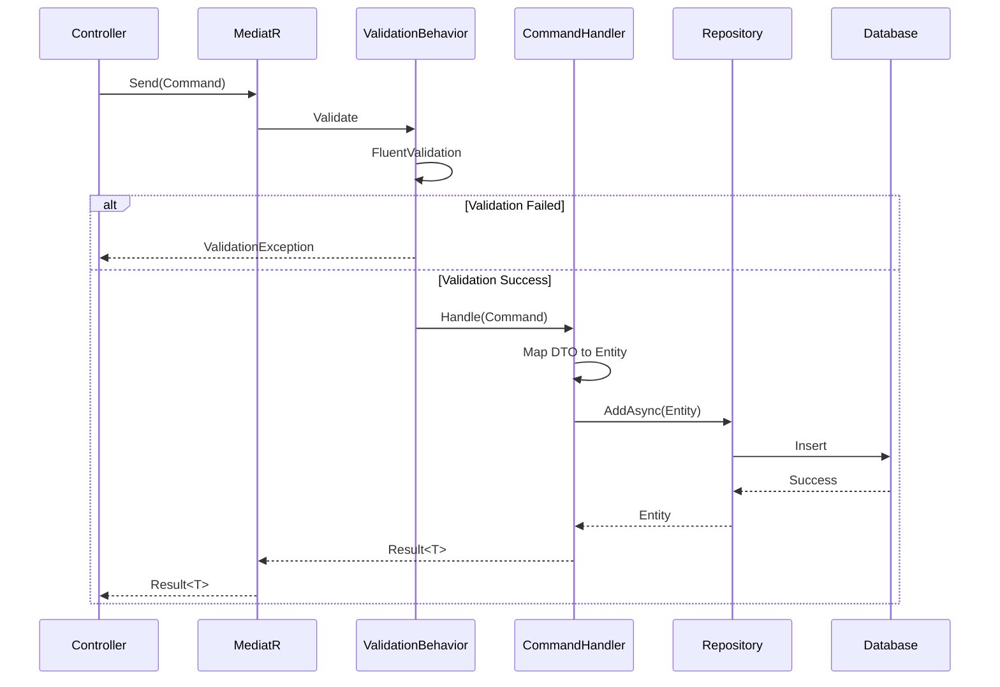

---


## لایه Infrastructure

### معرفی

لایه Infrastructure شامل پیاده‌سازی جزئیات فنی و ارتباط با منابع خارجی است. این لایه به Domain و Application وابسته است.

---

### DbContext و Entity Framework Core

#### ApplicationDbContext
```csharp
public class ApplicationDbContext : IdentityDbContext<ApplicationUser>
{
    // DbSets for all entities
    public DbSet<Product> Products { get; set; }
    public DbSet<ProductCategory> ProductCategories { get; set; }
    public DbSet<Brand> Brands { get; set; }
    public DbSet<Material> Materials { get; set; }
    public DbSet<Season> Seasons { get; set; }
    public DbSet<ProductVariant> ProductVariants { get; set; }
    public DbSet<ProductImage> ProductImages { get; set; }
    public DbSet<ProductDetail> ProductDetails { get; set; }
    public DbSet<ProductInventory> ProductInventories { get; set; }
    public DbSet<ProductReview> ProductReviews { get; set; }
    public DbSet<ProductRelation> ProductRelations { get; set; }
    public DbSet<Cart> Carts { get; set; }
    public DbSet<CartItem> CartItems { get; set; }
    public DbSet<SavedCart> SavedCarts { get; set; }
    public DbSet<UserOrder> UserOrders { get; set; }
    public DbSet<UserOrderItem> UserOrderItems { get; set; }
    public DbSet<UserPayment> UserPayments { get; set; }
    public DbSet<UserAddress> UserAddresses { get; set; }
    public DbSet<UserProfile> UserProfiles { get; set; }
    public DbSet<UserReturnRequest> UserReturnRequests { get; set; }
    public DbSet<Wishlist> Wishlists { get; set; }
    public DbSet<Coupon> Coupons { get; set; }
    public DbSet<UserCouponUsage> UserCouponUsages { get; set; }
    public DbSet<StockAlert> StockAlerts { get; set; }
    public DbSet<UserProductView> UserProductViews { get; set; }
    public DbSet<OrderStatusHistory> OrderStatusHistories { get; set; }
    public DbSet<Unit> Units { get; set; }
    public DbSet<Otp> Otps { get; set; }
    public DbSet<RefreshToken> RefreshTokens { get; set; }
    public DbSet<MahakMapping> MahakMappings { get; set; }
    public DbSet<MahakQueue> MahakQueues { get; set; }
    public DbSet<MahakSyncLog> MahakSyncLogs { get; set; }
    public DbSet<SyncErrorLog> SyncErrorLogs { get; set; }
    public DbSet<ProductMaterial> ProductMaterials { get; set; }
    public DbSet<ProductSeason> ProductSeasons { get; set; }

    protected override void OnModelCreating(ModelBuilder modelBuilder)
    {
        base.OnModelCreating(modelBuilder);

        // Apply all configurations
        modelBuilder.ApplyConfigurationsFromAssembly(Assembly.GetExecutingAssembly());
    }
}
```

---

### Database Configurations (28 Configuration)

هر Entity یک Configuration Class دارد:

**مثال ProductConfiguration:**
```csharp
public class ProductConfiguration : IEntityTypeConfiguration<Product>
{
    public void Configure(EntityTypeBuilder<Product> builder)
    {
        builder.ToTable("Products");

        builder.HasKey(p => p.Id);

        builder.Property(p => p.Name)
            .IsRequired()
            .HasMaxLength(200);

        builder.Property(p => p.Description)
            .HasMaxLength(2000);

        builder.Property(p => p.Price)
            .HasPrecision(18, 2);

        builder.Property(p => p.SalePrice)
            .HasPrecision(18, 2);

        builder.Property(p => p.Sku)
            .HasMaxLength(50);

        builder.Property(p => p.Barcode)
            .HasMaxLength(50);

        builder.Property(p => p.Gender)
            .HasMaxLength(20);

        builder.Property(p => p.Dimensions)
            .HasMaxLength(100);

        // Indexes
        builder.HasIndex(p => p.Name);
        builder.HasIndex(p => p.Sku).IsUnique();
        builder.HasIndex(p => p.Barcode);
        builder.HasIndex(p => p.CategoryId);
        builder.HasIndex(p => p.BrandId);
        builder.HasIndex(p => p.IsActive);
        builder.HasIndex(p => p.IsFeatured);

        // Relationships
        builder.HasOne(p => p.Category)
            .WithMany(c => c.Products)
            .HasForeignKey(p => p.CategoryId)
            .OnDelete(DeleteBehavior.SetNull);

        builder.HasOne(p => p.Brand)
            .WithMany(b => b.Products)
            .HasForeignKey(p => p.BrandId)
            .OnDelete(DeleteBehavior.SetNull);

        builder.HasOne(p => p.Unit)
            .WithMany(u => u.Products)
            .HasForeignKey(p => p.UnitId)
            .OnDelete(DeleteBehavior.SetNull);

        builder.HasMany(p => p.ProductImages)
            .WithOne(pi => pi.Product)
            .HasForeignKey(pi => pi.ProductId)
            .OnDelete(DeleteBehavior.Cascade);

        builder.HasMany(p => p.ProductVariants)
            .WithOne(pv => pv.Product)
            .HasForeignKey(pv => pv.ProductId)
            .OnDelete(DeleteBehavior.Cascade);

        // Soft Delete Filter
        builder.HasQueryFilter(p => !p.Deleted);
    }
}
```

**تنظیمات Many-to-Many:**
```csharp
public class ProductMaterialConfiguration : IEntityTypeConfiguration<ProductMaterial>
{
    public void Configure(EntityTypeBuilder<ProductMaterial> builder)
    {
        builder.HasKey(pm => new { pm.ProductId, pm.MaterialId });

        builder.HasOne(pm => pm.Product)
            .WithMany(p => p.ProductMaterials)
            .HasForeignKey(pm => pm.ProductId);

        builder.HasOne(pm => pm.Material)
            .WithMany(m => m.ProductMaterials)
            .HasForeignKey(pm => pm.MaterialId);
    }
}
```

---

### Repository Pattern Implementation

**مثال ProductRepository:**
```csharp
public class ProductRepository : IProductRepository
{
    private readonly ApplicationDbContext _context;

    public ProductRepository(ApplicationDbContext context)
    {
        _context = context;
    }

    public async Task<Product?> GetByIdAsync(Guid id, CancellationToken cancellationToken = default)
    {
        return await _context.Products
            .FirstOrDefaultAsync(p => p.Id == id, cancellationToken);
    }

    public async Task<Product?> GetByIdWithIncludesAsync(Guid id, CancellationToken cancellationToken = default)
    {
        return await _context.Products
            .Include(p => p.Category)
            .Include(p => p.Brand)
            .Include(p => p.Unit)
            .Include(p => p.ProductImages.OrderBy(i => i.DisplayOrder))
            .Include(p => p.ProductVariants.OrderBy(v => v.DisplayOrder))
            .Include(p => p.ProductMaterials).ThenInclude(pm => pm.Material)
            .Include(p => p.ProductSeasons).ThenInclude(ps => ps.Season)
            .Include(p => p.ProductReviews.Where(r => r.IsApproved))
            .FirstOrDefaultAsync(p => p.Id == id, cancellationToken);
    }

    public async Task<IEnumerable<Product>> GetAllAsync(CancellationToken cancellationToken = default)
    {
        return await _context.Products
            .ToListAsync(cancellationToken);
    }

    public async Task<IEnumerable<Product>> GetAllWithIncludesAsync(CancellationToken cancellationToken = default)
    {
        return await _context.Products
            .Include(p => p.Category)
            .Include(p => p.Brand)
            .Include(p => p.ProductImages.Where(i => i.IsPrimary))
            .ToListAsync(cancellationToken);
    }

    public async Task<Product> AddAsync(Product entity, CancellationToken cancellationToken = default)
    {
        await _context.Products.AddAsync(entity, cancellationToken);
        await _context.SaveChangesAsync(cancellationToken);
        return entity;
    }

    public async Task UpdateAsync(Product entity, CancellationToken cancellationToken = default)
    {
        _context.Products.Update(entity);
        await _context.SaveChangesAsync(cancellationToken);
    }

    public async Task DeleteAsync(Guid id, CancellationToken cancellationToken = default)
    {
        var entity = await GetByIdAsync(id, cancellationToken);
        if (entity != null)
        {
            entity.Delete();
            await _context.SaveChangesAsync(cancellationToken);
        }
    }

    public async Task<bool> ExistsBySkuAsync(string sku, CancellationToken cancellationToken = default)
    {
        return await _context.Products
            .AnyAsync(p => p.Sku == sku, cancellationToken);
    }
}
```

**لیست کامل Repositories (32 Repository):**
1. ProductRepository
2. ProductCategoryRepository
3. BrandRepository
4. MaterialRepository
5. SeasonRepository
6. ProductVariantRepository
7. ProductImageRepository
8. ProductDetailRepository
9. ProductInventoryRepository
10. ProductReviewRepository
11. ProductRelationRepository
12. CartRepository
13. CartItemRepository
14. SavedCartRepository
15. UserOrderRepository
16. UserOrderItemRepository
17. UserPaymentRepository
18. UserAddressRepository
19. UserProfileRepository
20. UserReturnRequestRepository
21. WishlistRepository
22. CouponRepository
23. UserCouponUsageRepository
24. StockAlertRepository
25. UserProductViewRepository
26. OrderStatusHistoryRepository
27. UnitRepository
28. OtpRepository
29. RefreshTokenRepository
30. MahakMappingRepository
31. MahakQueueRepository
32. MahakSyncLogRepository

---

### External Services

#### TokenService
مدیریت JWT و Refresh Tokens:

```csharp
public class TokenService : ITokenService
{
    private readonly UserManager<ApplicationUser> _userManager;
    private readonly IConfiguration _configuration;
    private readonly IRefreshTokenRepository _refreshTokenRepository;

    public async Task<AuthResponseDto> GenerateTokensAsync(string emailOrPhoneNumber)
    {
        // Find user by email or phone
        var user = await _userManager.FindByEmailAsync(emailOrPhoneNumber) ??
                   await _userManager.FindByNameAsync(emailOrPhoneNumber);

        if (user == null)
            throw new NotFoundException("کاربر یافت نشد");

        // Get user roles
        var roles = await _userManager.GetRolesAsync(user);

        // Create claims
        var claims = new List<Claim>
        {
            new Claim(ClaimTypes.NameIdentifier, user.Id),
            new Claim(ClaimTypes.Email, user.Email ?? user.UserName ?? ""),
            new Claim(ClaimTypes.Name, user.UserName ?? ""),
            new Claim("PhoneNumber", user.PhoneNumber ?? "")
        };

        foreach (var role in roles)
        {
            claims.Add(new Claim(ClaimTypes.Role, role));
        }

        // Generate JWT token
        var key = new SymmetricSecurityKey(Encoding.UTF8.GetBytes(_configuration["JwtSettings:Secret"]!));
        var credentials = new SigningCredentials(key, SecurityAlgorithms.HmacSha256);
        var expires = DateTime.UtcNow.AddMinutes(Convert.ToDouble(_configuration["JwtSettings:ExpirationMinutes"]));

        var token = new JwtSecurityToken(
            issuer: _configuration["JwtSettings:Issuer"],
            audience: _configuration["JwtSettings:Audience"],
            claims: claims,
            expires: expires,
            signingCredentials: credentials
        );

        // Generate refresh token
        var refreshToken = RefreshToken.Create(Guid.Parse(user.Id));
        await _refreshTokenRepository.AddAsync(refreshToken);

        return new AuthResponseDto
        {
            Token = new JwtSecurityTokenHandler().WriteToken(token),
            RefreshToken = refreshToken.Token,
            Expiration = expires,
            Email = user.Email ?? user.UserName ?? emailOrPhoneNumber
        };
    }

    // RefreshTokensAsync, RevokeRefreshTokenAsync methods...
}
```

#### KavenegarSmsService
سرویس ارسال SMS واقعی:

```csharp
public class KavenegarSmsService : ISmsService
{
    private readonly IOptions<SmsSettings> _smsSettings;
    private readonly ILogger<KavenegarSmsService> _logger;

    public async Task<bool> SendSmsAsync(string phoneNumber, string message)
    {
        try
        {
            var api = new KavenegarApi(_smsSettings.Value.ApiKey);
            var result = await api.Send(_smsSettings.Value.Sender, phoneNumber, message);
            
            _logger.LogInformation($"SMS sent to {phoneNumber}: {result.Messageid}");
            return true;
        }
        catch (Exception ex)
        {
            _logger.LogError(ex, $"Failed to send SMS to {phoneNumber}");
            return false;
        }
    }

    public async Task<bool> SendOtpAsync(string phoneNumber, string code)
    {
        var message = $"کد تایید شما: {code}\nاین کد تا 5 دقیقه معتبر است.";
        return await SendSmsAsync(phoneNumber, message);
    }
}
```

#### MockSmsService
سرویس SMS تستی (برای Development):

```csharp
public class MockSmsService : ISmsService
{
    private readonly ILogger<MockSmsService> _logger;

    public Task<bool> SendSmsAsync(string phoneNumber, string message)
    {
        _logger.LogInformation($"[MOCK SMS] To: {phoneNumber}, Message: {message}");
        return Task.FromResult(true);
    }

    public Task<bool> SendOtpAsync(string phoneNumber, string code)
    {
        _logger.LogInformation($"[MOCK OTP] To: {phoneNumber}, Code: {code}");
        return Task.FromResult(true);
    }
}
```

---

### Migrations

سیستم دارای 23 Migration است:

1. `InitialCreate`: ساخت اولیه دیتابیس
2. `AddOtpEntity`: افزودن جدول OTP
3. `AddRefreshToken`: افزودن Refresh Token
4. `EnhancedProducts`: محصولات پیشرفته (Brand, Variant, Material, Season)
5. `AddProductImages`: تصاویر محصول
6. `AddCoupons`: سیستم کوپن
7. `AddStockAlerts`: هشدار موجودی
8. `AddOrderStatusHistory`: تاریخچه سفارشات
9. ...

**مثال Migration:**
```bash
dotnet ef migrations add AddOtpEntity -p src/Infrastructure -s src/WebAPI
dotnet ef database update -p src/Infrastructure -s src/WebAPI
```

---

### Authentication & Authorization

#### JWT Configuration
```csharp
services.AddAuthentication(options =>
{
    options.DefaultAuthenticateScheme = JwtBearerDefaults.AuthenticationScheme;
    options.DefaultChallengeScheme = JwtBearerDefaults.AuthenticationScheme;
})
.AddJwtBearer(options =>
{
    options.TokenValidationParameters = new TokenValidationParameters
    {
        ValidateIssuer = true,
        ValidateAudience = true,
        ValidateLifetime = true,
        ValidateIssuerSigningKey = true,
        ValidIssuer = builder.Configuration["JwtSettings:Issuer"],
        ValidAudience = builder.Configuration["JwtSettings:Audience"],
        IssuerSigningKey = new SymmetricSecurityKey(Encoding.UTF8.GetBytes(builder.Configuration["JwtSettings:Secret"]!))
    };
});
```

#### Identity Configuration
```csharp
services.AddIdentity<ApplicationUser, IdentityRole>(options =>
{
    options.Password.RequireDigit = true;
    options.Password.RequireLowercase = true;
    options.Password.RequireUppercase = true;
    options.Password.RequireNonAlphanumeric = false;
    options.Password.RequiredLength = 8;

    options.User.RequireUniqueEmail = true;
    options.SignIn.RequireConfirmedEmail = false;
})
.AddEntityFrameworkStores<ApplicationDbContext>()
.AddDefaultTokenProviders();
```

---

### Logging با Serilog

```csharp
builder.Host.UseSerilog((context, configuration) =>
{
    configuration
        .ReadFrom.Configuration(context.Configuration)
        .WriteTo.Console()
        .WriteTo.File("logs/log-.txt", rollingInterval: RollingInterval.Day)
        .WriteTo.PostgreSQL(
            connectionString: context.Configuration.GetConnectionString("DefaultConnection")!,
            tableName: "Logs",
            needAutoCreateTable: true);
});
```

---

### ServiceRegistration

```csharp
public static class ServiceRegistration
{
    public static IServiceCollection AddInfrastructureServices(
        this IServiceCollection services,
        IConfiguration configuration)
    {
        // Database
        services.AddDbContext<ApplicationDbContext>(options =>
            options.UseNpgsql(configuration.GetConnectionString("DefaultConnection")));

        // Identity
        services.AddIdentity<ApplicationUser, IdentityRole>(/* options */)
            .AddEntityFrameworkStores<ApplicationDbContext>()
            .AddDefaultTokenProviders();

        // Authentication
        services.AddAuthentication(/* JWT configuration */);

        // Repositories
        services.AddScoped<IProductRepository, ProductRepository>();
        services.AddScoped<IOrderRepository, OrderRepository>();
        // ... all 32 repositories

        // External Services
        var smsProvider = configuration["SmsSettings:Provider"];
        if (smsProvider == "Kavenegar")
            services.AddScoped<ISmsService, KavenegarSmsService>();
        else
            services.AddScoped<ISmsService, MockSmsService>();

        services.AddScoped<ITokenService, TokenService>();

        return services;
    }
}
```

---

## لایه WebAPI

### معرفی

لایه WebAPI رابط کاربری RESTful سیستم است که از طریق HTTP با کلاینت‌ها ارتباط برقرار می‌کند.

---

### Controllers (28 Controller)

هر Feature یک Controller دارد:

**مثال ProductController:**
```csharp
[ApiController]
[Route("api/[controller]")]
public class ProductController : ControllerBase
{
    private readonly IMediator _mediator;

    public ProductController(IMediator mediator)
    {
        _mediator = mediator;
    }

    [HttpGet]
    public async Task<IActionResult> GetAll()
    {
        var query = new GetAllProductsQuery();
        var result = await _mediator.Send(query);

        return result.IsSuccess
            ? Ok(result.Value)
            : BadRequest(result.ErrorMessage);
    }

    [HttpGet("{id}")]
    public async Task<IActionResult> GetById(Guid id)
    {
        var query = new GetProductByIdQuery { Id = id };
        var result = await _mediator.Send(query);

        return result.IsSuccess
            ? Ok(result.Value)
            : NotFound(result.ErrorMessage);
    }

    [HttpPost]
    [Authorize(Roles = "Admin")]
    public async Task<IActionResult> Create([FromBody] CreateProductDto dto)
    {
        var command = new CreateProductCommand { Product = dto };
        var result = await _mediator.Send(command);

        return result.IsSuccess
            ? CreatedAtAction(nameof(GetById), new { id = result.Value }, result.Value)
            : BadRequest(result.ErrorMessage);
    }

    [HttpPut("{id}")]
    [Authorize(Roles = "Admin")]
    public async Task<IActionResult> Update(Guid id, [FromBody] UpdateProductDto dto)
    {
        if (id != dto.Id)
            return BadRequest("شناسه محصول مطابقت ندارد");

        var command = new UpdateProductCommand { Product = dto };
        var result = await _mediator.Send(command);

        return result.IsSuccess
            ? Ok(result.Value)
            : BadRequest(result.ErrorMessage);
    }

    [HttpDelete("{id}")]
    [Authorize(Roles = "Admin")]
    public async Task<IActionResult> Delete(Guid id)
    {
        var command = new DeleteProductCommand { Id = id };
        var result = await _mediator.Send(command);

        return result.IsSuccess
            ? NoContent()
            : BadRequest(result.ErrorMessage);
    }

    [HttpPost("search")]
    public async Task<IActionResult> Search([FromBody] ProductSearchDto searchDto)
    {
        var query = new ProductSearchQuery 
        { 
            SearchTerm = searchDto.SearchTerm,
            CategoryId = searchDto.CategoryId,
            BrandId = searchDto.BrandId,
            // ... other filters
        };

        var result = await _mediator.Send(query);

        return result.IsSuccess
            ? Ok(result.Value)
            : BadRequest(result.ErrorMessage);
    }
}
```

**لیست کامل Controllers:**
1. AuthController
2. ProductController
3. BrandController
4. MaterialController
5. SeasonController
6. ProductVariantController
7. ProductCategoryController
8. ProductImageController
9. ProductDetailController
10. ProductInventoryController
11. ProductReviewController
12. CartController
13. SavedCartController
14. CheckoutController
15. UserOrderController
16. OrderTrackingController
17. UserPaymentController
18. UserAddressController
19. UserProfileController
20. UserReturnRequestController
21. WishlistController
22. CouponController
23. StockAlertController
24. UnitController
25. MahakMappingController
26. MahakQueueController
27. MahakSyncLogController
28. SyncErrorLogController

---

### Middlewares

#### ExceptionHandlingMiddleware
```csharp
public class ExceptionHandlingMiddleware
{
    private readonly RequestDelegate _next;
    private readonly ILogger<ExceptionHandlingMiddleware> _logger;

    public async Task InvokeAsync(HttpContext context)
    {
        try
        {
            await _next(context);
        }
        catch (FluentValidation.ValidationException ex)
        {
            _logger.LogWarning(ex, "Validation error occurred");

            context.Response.StatusCode = StatusCodes.Status400BadRequest;
            context.Response.ContentType = "application/json";

            var errors = ex.Errors.Select(e => e.ErrorMessage).ToList();
            var response = new
            {
                title = "خطای اعتبارسنجی",
                status = 400,
                errors
            };

            await context.Response.WriteAsJsonAsync(response);
        }
        catch (NotFoundException ex)
        {
            _logger.LogWarning(ex, "Not found error occurred");

            context.Response.StatusCode = StatusCodes.Status404NotFound;
            context.Response.ContentType = "application/json";

            var response = new
            {
                title = "یافت نشد",
                status = 404,
                error = ex.Message
            };

            await context.Response.WriteAsJsonAsync(response);
        }
        catch (Exception ex)
        {
            _logger.LogError(ex, "Unhandled exception occurred");

            context.Response.StatusCode = StatusCodes.Status500InternalServerError;
            context.Response.ContentType = "application/json";

            var response = new
            {
                title = "خطای سرور",
                status = 500,
                error = "خطای داخلی سرور رخ داده است."
            };

            await context.Response.WriteAsJsonAsync(response);
        }
    }
}
```

#### RequestLoggingMiddleware
```csharp
public class RequestLoggingMiddleware
{
    private readonly RequestDelegate _next;
    private readonly ILogger<RequestLoggingMiddleware> _logger;

    public async Task InvokeAsync(HttpContext context)
    {
        var stopwatch = Stopwatch.StartNew();

        _logger.LogInformation($"Request: {context.Request.Method} {context.Request.Path}");

        await _next(context);

        stopwatch.Stop();

        _logger.LogInformation($"Response: {context.Response.StatusCode} ({stopwatch.ElapsedMilliseconds}ms)");
    }
}
```

---

### Configuration Files

#### appsettings.json
```json
{
  "ConnectionStrings": {
    "DefaultConnection": "Host=localhost;Database=OnlineShopDb;Username=postgres;Password=***"
  },
  "JwtSettings": {
    "Secret": "YourSuperSecretKeyThatIsAtLeast32CharactersLong",
    "Issuer": "OnlineShop",
    "Audience": "OnlineShopUsers",
    "ExpirationMinutes": 60
  },
  "SmsSettings": {
    "Provider": "Mock",
    "ApiKey": "",
    "Sender": "",
    "OtpExpirationMinutes": 5,
    "OtpLength": 6
  },
  "Serilog": {
    "MinimumLevel": {
      "Default": "Information",
      "Override": {
        "Microsoft": "Warning",
        "System": "Warning"
      }
    }
  }
}
```

---

### Program.cs

```csharp
var builder = WebApplication.CreateBuilder(args);

// Add services
builder.Services.AddControllers();
builder.Services.AddEndpointsApiExplorer();
builder.Services.AddSwaggerGen();

// Application services
builder.Services.AddApplicationServices();

// Infrastructure services
builder.Services.AddInfrastructureServices(builder.Configuration);

// Serilog
builder.Host.UseSerilog(/* configuration */);

var app = builder.Build();

// Seed database
using (var scope = app.Services.CreateScope())
{
    var roleManager = scope.ServiceProvider.GetRequiredService<RoleManager<IdentityRole>>();
    await DatabaseSeeder.SeedRolesAsync(roleManager);
}

// Configure pipeline
if (app.Environment.IsDevelopment())
{
    app.UseSwagger();
    app.UseSwaggerUI();
}

app.UseMiddleware<ExceptionHandlingMiddleware>();
app.UseMiddleware<RequestLoggingMiddleware>();

app.UseHttpsRedirection();

app.UseAuthentication();
app.UseAuthorization();

app.MapControllers();

app.Run();
```

---

### Swagger/OpenAPI Configuration

```csharp
builder.Services.AddSwaggerGen(options =>
{
    options.SwaggerDoc("v1", new OpenApiInfo
    {
        Title = "OnlineShop API",
        Version = "v1",
        Description = "API برای سیستم فروشگاه آنلاین",
        Contact = new OpenApiContact
        {
            Name = "Support",
            Email = "support@onlineshop.com"
        }
    });

    options.AddSecurityDefinition("Bearer", new OpenApiSecurityScheme
    {
        Description = "JWT Authorization header using the Bearer scheme.",
        Name = "Authorization",
        In = ParameterLocation.Header,
        Type = SecuritySchemeType.ApiKey,
        Scheme = "Bearer"
    });

    options.AddSecurityRequirement(new OpenApiSecurityRequirement
    {
        {
            new OpenApiSecurityScheme
            {
                Reference = new OpenApiReference
                {
                    Type = ReferenceType.SecurityScheme,
                    Id = "Bearer"
                }
            },
            Array.Empty<string>()
        }
    });
});
```

---


## جریان‌های اصلی سیستم (System Flows)

### 1. جریان احراز هویت (Authentication Flow)

#### ثبت‌نام سنتی (Email/Password Registration)

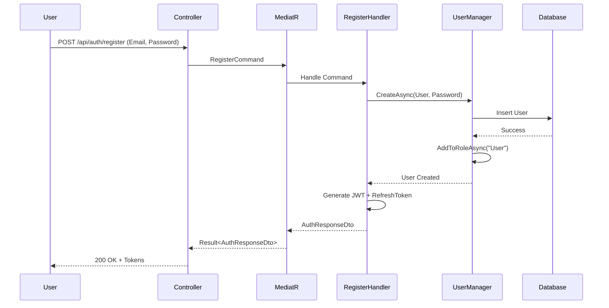

---

#### ورود با OTP (Login with Phone Number)

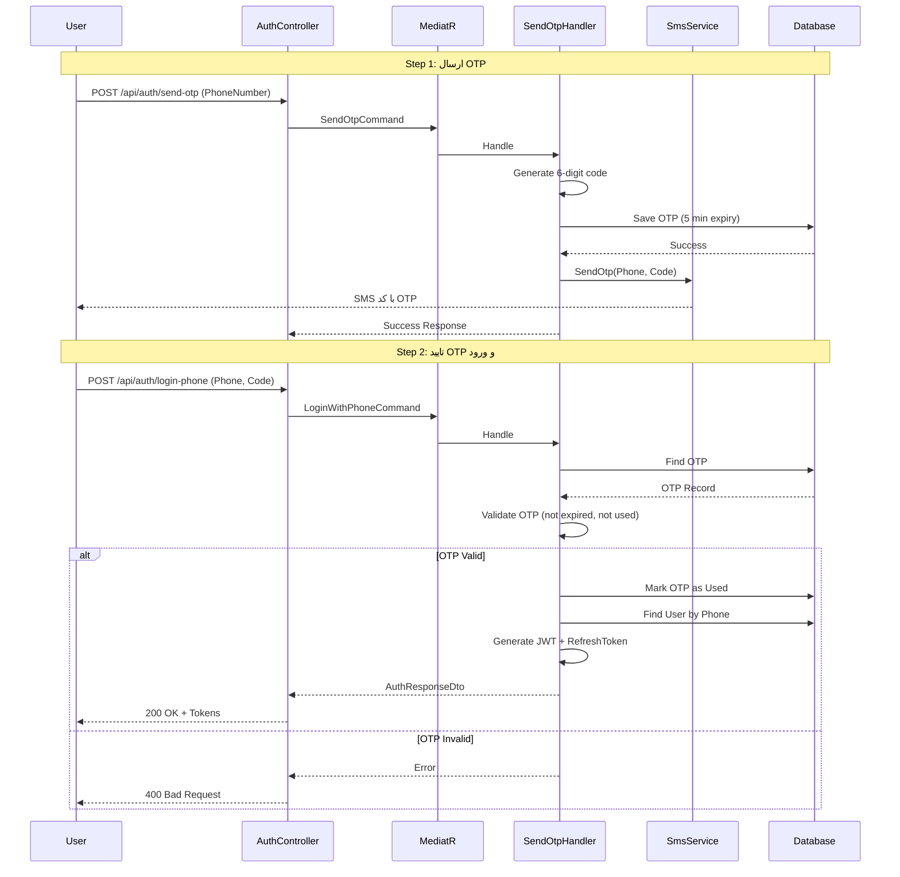

---

### 2. جریان خرید محصول (Shopping Flow)

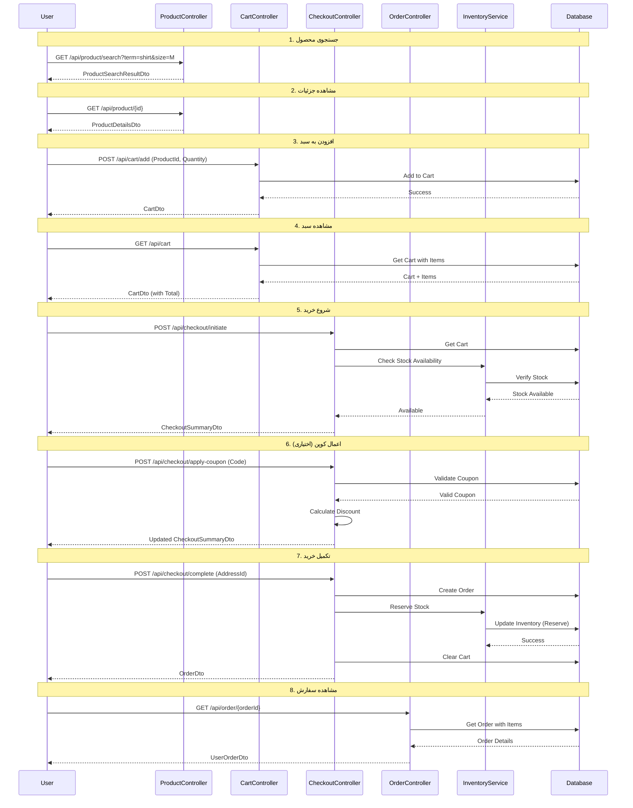

---

### 3. جریان پردازش سفارش (Order Processing Flow)

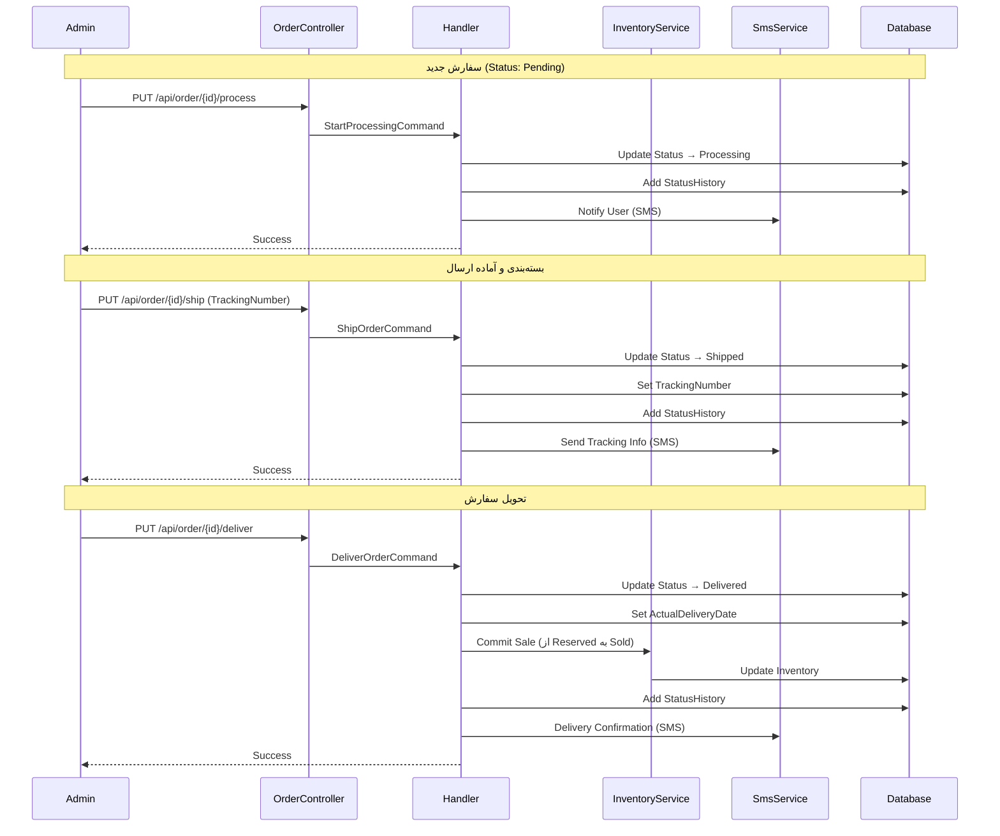

---

### 4. جریان مرجوعی (Return Request Flow)

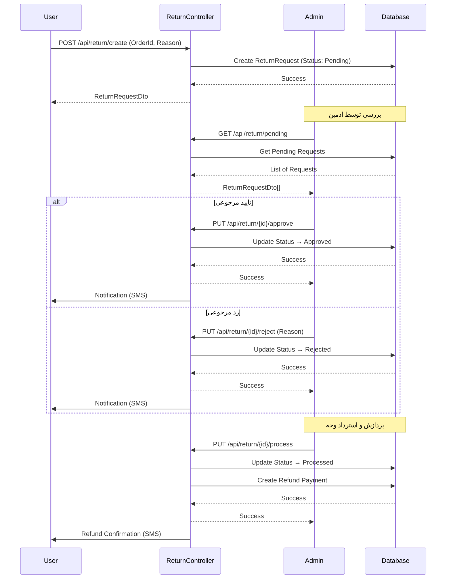

---

### 5. جریان نظرات محصول (Product Review Flow)

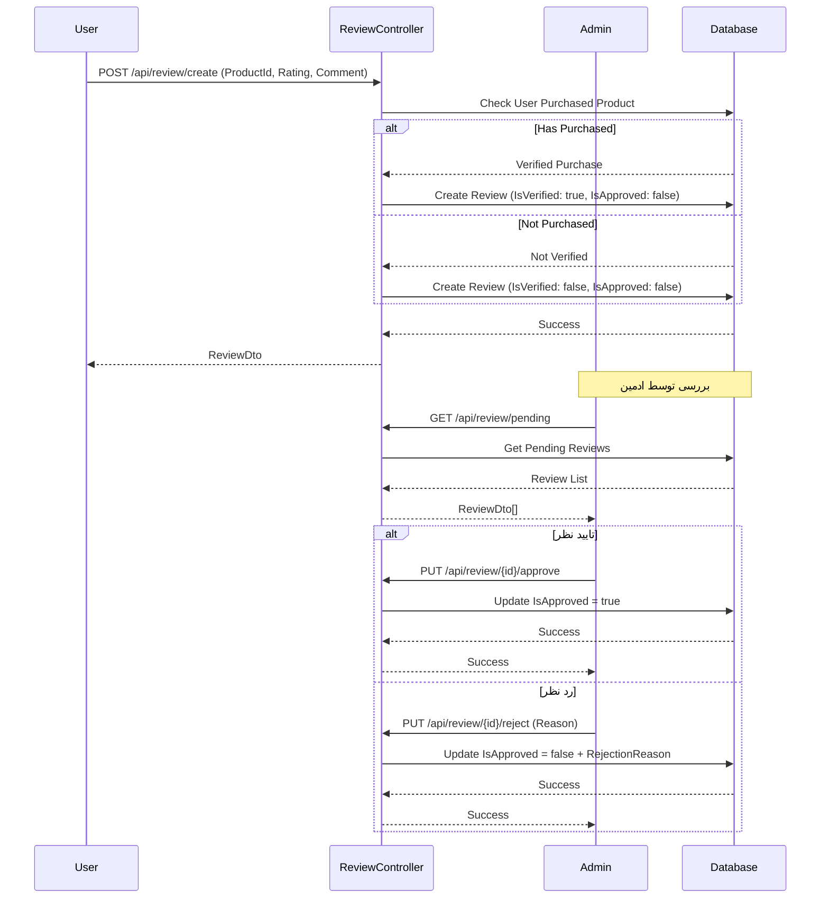

---

## طراحی دیتابیس (Database Design)

### Entity Relationship Diagram (ERD)

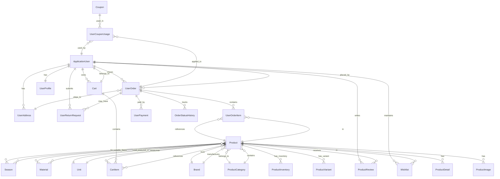

---

### جداول اصلی

#### 1. کاربران (Users)
- **ApplicationUser** (ASP.NET Identity): اطلاعات احراز هویت
- **UserProfile**: اطلاعات تکمیلی کاربر
- **UserAddress**: آدرس‌های کاربر
- **Otp**: کدهای یکبار مصرف
- **RefreshToken**: توکن‌های تازه‌سازی

#### 2. محصولات (Products)
- **Product**: محصول اصلی
- **ProductCategory**: دسته‌بندی‌ها
- **Brand**: برندها
- **Material**: مواد و جنس‌ها
- **Season**: فصل‌ها
- **Unit**: واحدهای اندازه‌گیری
- **ProductVariant**: تنوع محصولات
- **ProductImage**: تصاویر
- **ProductDetail**: جزئیات فنی
- **ProductInventory**: موجودی
- **ProductReview**: نظرات
- **ProductRelation**: محصولات مرتبط
- **ProductMaterial**: جدول واسط محصول-جنس
- **ProductSeason**: جدول واسط محصول-فصل

#### 3. خرید (Shopping)
- **Cart**: سبد خرید
- **CartItem**: آیتم‌های سبد
- **SavedCart**: سبدهای ذخیره شده

#### 4. سفارشات (Orders)
- **UserOrder**: سفارش
- **UserOrderItem**: آیتم‌های سفارش
- **OrderStatusHistory**: تاریخچه وضعیت
- **UserPayment**: پرداخت‌ها
- **UserReturnRequest**: درخواست‌های مرجوعی

#### 5. تخفیف (Discounts)
- **Coupon**: کوپن‌های تخفیف
- **UserCouponUsage**: استفاده از کوپن‌ها

#### 6. سایر (Others)
- **Wishlist**: علاقه‌مندی‌ها
- **StockAlert**: هشدارهای موجودی
- **UserProductView**: بازدیدها

#### 7. یکپارچگی Mahak (Mahak Integration)
- **MahakMapping**: نگاشت‌ها
- **MahakQueue**: صف همگام‌سازی
- **MahakSyncLog**: لاگ همگام‌سازی
- **SyncErrorLog**: لاگ خطاها

---

### Indexes مهم

```sql
-- Products
CREATE INDEX IX_Products_Name ON Products(Name);
CREATE UNIQUE INDEX IX_Products_Sku ON Products(Sku);
CREATE INDEX IX_Products_CategoryId ON Products(CategoryId);
CREATE INDEX IX_Products_BrandId ON Products(BrandId);
CREATE INDEX IX_Products_IsActive_IsFeatured ON Products(IsActive, IsFeatured);

-- Orders
CREATE INDEX IX_Orders_UserId ON UserOrders(UserId);
CREATE INDEX IX_Orders_OrderNumber ON UserOrders(OrderNumber);
CREATE INDEX IX_Orders_OrderStatus ON UserOrders(OrderStatus);
CREATE INDEX IX_Orders_CreatedAt ON UserOrders(CreatedAt);

-- Cart
CREATE INDEX IX_Cart_UserId ON Carts(UserId);
CREATE INDEX IX_Cart_SessionId ON Carts(SessionId);

-- Reviews
CREATE INDEX IX_Reviews_ProductId_IsApproved ON ProductReviews(ProductId, IsApproved);

-- OTP
CREATE INDEX IX_Otp_PhoneNumber_IsUsed ON Otps(PhoneNumber, IsUsed);
CREATE INDEX IX_Otp_ExpiresAt ON Otps(ExpiresAt);
```

---

### Soft Delete Implementation

تمام جداول از Soft Delete استفاده می‌کنند:

```sql
ALTER TABLE Products ADD Deleted BIT DEFAULT 0;

-- Query Filter in EF Core
builder.HasQueryFilter(p => !p.Deleted);
```

---

## مستندات API (API Documentation)

### Base URL
```
Development: https://localhost:5001/api
Production: https://api.onlineshop.com/api
```

---

### Authentication Endpoints

#### POST /api/auth/register
ثبت‌نام با ایمیل و رمز عبور

**Request:**
```json
{
  "email": "user@example.com",
  "password": "Password123!",
  "firstName": "علی",
  "lastName": "احمدی",
  "phoneNumber": "09123456789"
}
```

**Response (200 OK):**
```json
{
  "token": "eyJhbGciOiJIUzI1NiIsInR5cCI6IkpXVCJ9...",
  "refreshToken": "abc123...",
  "expiration": "2024-10-16T14:30:00Z",
  "email": "user@example.com"
}
```

---

#### POST /api/auth/send-otp
ارسال کد OTP

**Request:**
```json
{
  "phoneNumber": "09123456789",
  "purpose": "Login"
}
```

**Response (200 OK):**
```json
{
  "success": true,
  "message": "کد تایید ارسال شد",
  "expiresAt": "2024-10-16T12:35:00Z"
}
```

---

#### POST /api/auth/login-phone
ورود با شماره تلفن و OTP

**Request:**
```json
{
  "phoneNumber": "09123456789",
  "code": "123456"
}
```

**Response (200 OK):**
```json
{
  "token": "eyJhbGciOiJIUzI1NiIsInR5cCI6IkpXVCJ9...",
  "refreshToken": "abc123...",
  "expiration": "2024-10-16T14:30:00Z",
  "email": "09123456789@phone.local"
}
```

---

### Product Endpoints

#### GET /api/product
لیست تمام محصولات

**Response (200 OK):**
```json
[
  {
    "id": "guid",
    "name": "تیشرت مردانه",
    "price": 250000,
    "salePrice": 200000,
    "stockQuantity": 50,
    "isActive": true,
    "isFeatured": true,
    "category": { "id": "guid", "name": "پوشاک مردانه" },
    "brand": { "id": "guid", "name": "برند A" },
    "images": [
      {
        "imageUrl": "/images/product1.jpg",
        "isPrimary": true
      }
    ]
  }
]
```

---

#### POST /api/product/search
جستجوی پیشرفته محصولات

**Request:**
```json
{
  "searchTerm": "تیشرت",
  "categoryId": "guid",
  "brandId": "guid",
  "gender": "Male",
  "sizes": ["M", "L"],
  "colors": ["قرمز", "آبی"],
  "minPrice": 100000,
  "maxPrice": 500000,
  "onSale": true,
  "sortBy": "price_asc",
  "pageNumber": 1,
  "pageSize": 20
}
```

**Response (200 OK):**
```json
{
  "products": [...],
  "totalCount": 45,
  "totalPages": 3,
  "currentPage": 1,
  "availableSizes": ["S", "M", "L", "XL"],
  "availableColors": ["قرمز", "آبی", "سبز"],
  "availableBrands": [...],
  "priceRange": {
    "min": 100000,
    "max": 800000
  }
}
```

---

### Cart Endpoints

#### POST /api/cart/add
افزودن به سبد خرید

**Request:**
```json
{
  "productId": "guid",
  "quantity": 2
}
```

**Response (200 OK):**
```json
{
  "id": "guid",
  "userId": "guid",
  "items": [
    {
      "productId": "guid",
      "productName": "تیشرت مردانه",
      "quantity": 2,
      "unitPrice": 200000,
      "totalPrice": 400000
    }
  ],
  "subTotal": 400000,
  "taxAmount": 36000,
  "totalAmount": 436000,
  "itemsCount": 2
}
```

---

### Order Endpoints

#### GET /api/order/{id}
دریافت جزئیات سفارش

**Response (200 OK):**
```json
{
  "id": "guid",
  "orderNumber": "ORD-2024-10001",
  "orderStatus": "Processing",
  "subTotal": 400000,
  "taxAmount": 36000,
  "shippingAmount": 30000,
  "discountAmount": 50000,
  "totalAmount": 416000,
  "trackingNumber": "TRK123456",
  "estimatedDeliveryDate": "2024-10-20",
  "items": [...],
  "shippingAddress": {...},
  "createdAt": "2024-10-16T10:00:00Z"
}
```

---

#### GET /api/order/{id}/timeline
تاریخچه وضعیت سفارش

**Response (200 OK):**
```json
{
  "orderId": "guid",
  "orderNumber": "ORD-2024-10001",
  "currentStatus": "Shipped",
  "trackingNumber": "TRK123456",
  "statusHistory": [
    {
      "status": "Pending",
      "changedAt": "2024-10-16T10:00:00Z",
      "notes": "سفارش ثبت شد"
    },
    {
      "status": "Processing",
      "changedAt": "2024-10-16T11:00:00Z",
      "notes": "در حال پردازش"
    },
    {
      "status": "Shipped",
      "changedAt": "2024-10-17T09:00:00Z",
      "notes": "ارسال شد"
    }
  ]
}
```

---

### Error Responses

#### 400 Bad Request (Validation Error)
```json
{
  "title": "خطای اعتبارسنجی",
  "status": 400,
  "errors": [
    "نام محصول الزامی است",
    "قیمت باید بزرگتر از صفر باشد"
  ]
}
```

#### 404 Not Found
```json
{
  "title": "یافت نشد",
  "status": 404,
  "error": "محصول با این شناسه یافت نشد"
}
```

#### 500 Internal Server Error
```json
{
  "title": "خطای سرور",
  "status": 500,
  "error": "خطای داخلی سرور رخ داده است"
}
```

---

## استراتژی تست (Testing Strategy)

### Unit Tests

**پوشش تست:**
- تمام Command Handlers
- تمام Query Handlers
- تمام Validators
- Domain Entity Methods
- Business Logic

**Framework ها:**
- xUnit
- Moq (Mocking)
- FluentAssertions

**مثال تست:**
```csharp
public class CreateProductCommandHandlerTests
{
    [Fact]
    public async Task Handle_ValidRequest_ShouldCreateProduct()
    {
        // Arrange
        var mockRepo = new Mock<IProductRepository>();
        var mockMapper = new Mock<IMapper>();
        
        var command = new CreateProductCommand { /* ... */ };
        var handler = new CreateProductCommandHandler(mockRepo.Object, mockMapper.Object);

        // Act
        var result = await handler.Handle(command, CancellationToken.None);

        // Assert
        result.IsSuccess.Should().BeTrue();
        mockRepo.Verify(r => r.AddAsync(It.IsAny<Product>(), It.IsAny<CancellationToken>()), Times.Once);
    }
}
```

**وضعیت فعلی:**
- 158 تست موجود
- 146 تست موفق (92.4%)
- 12 تست ناموفق (به دلیل AutoMapper validation)

---

### Integration Tests

**سناریوهای تست:**
1. User Journey: Register → Login → Browse → Add to Cart → Checkout
2. Product Catalog: List → Filter → Search → View Details
3. Cart Management: Add → Update → Remove → Clear
4. Order Lifecycle: Create → Process → Ship → Deliver
5. Return Request: Submit → Approve/Reject → Process

**Framework ها:**
- WebApplicationFactory
- In-Memory Database
- xUnit

---

### Test Coverage Target

- **Unit Tests**: حداقل 80%
- **Integration Tests**: سناریوهای کاربری اصلی
- **E2E Tests**: کریتیکال پث‌ها

---

## استقرار و پیکربندی (Deployment & Configuration)

### Environment Variables

```bash
# Database
ConnectionStrings__DefaultConnection="Host=...;Database=...;Username=...;Password=..."

# JWT
JwtSettings__Secret="YourSecretKey"
JwtSettings__Issuer="OnlineShop"
JwtSettings__Audience="OnlineShopUsers"
JwtSettings__ExpirationMinutes="60"

# SMS
SmsSettings__Provider="Kavenegar"
SmsSettings__ApiKey="your-api-key"
SmsSettings__Sender="10008663"
```

---

### Deployment Checklist

- [ ] تنظیم Connection String تولید
- [ ] تنظیم JWT Secret قوی
- [ ] فعال‌سازی HTTPS
- [ ] تنظیم CORS Policy
- [ ] فعال‌سازی Logging
- [ ] پیکربندی SMS Service (Kavenegar)
- [ ] اجرای Migrations
- [ ] Seed کردن Roles (Admin, User)
- [ ] تست Load Testing
- [ ] راه‌اندازی Backup خودکار

---


## دیاگرام‌های تکمیلی

### System Architecture Overview

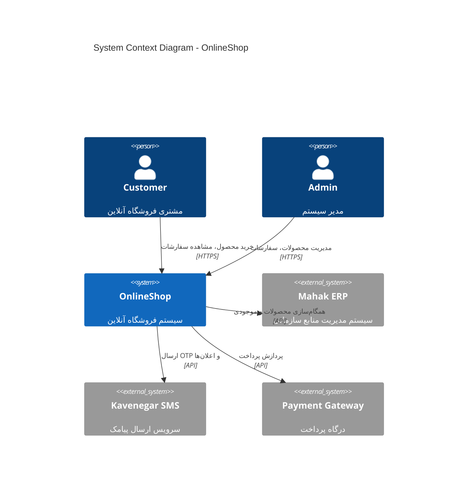

---

### Component Diagram - Internal Architecture

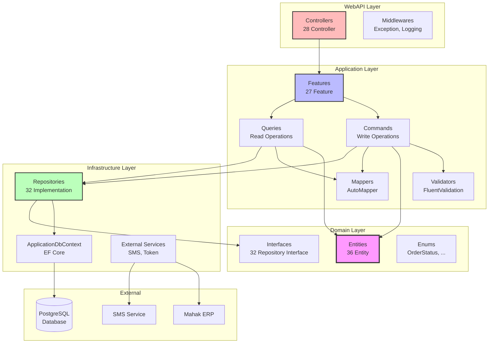

---

### Data Flow - Complete Request/Response Cycle

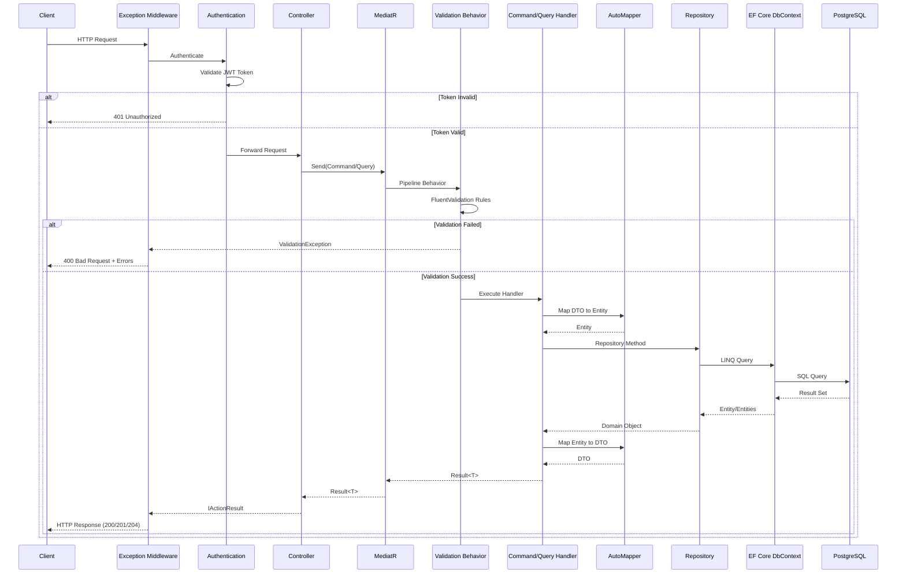

---

### Authentication & Authorization Flow

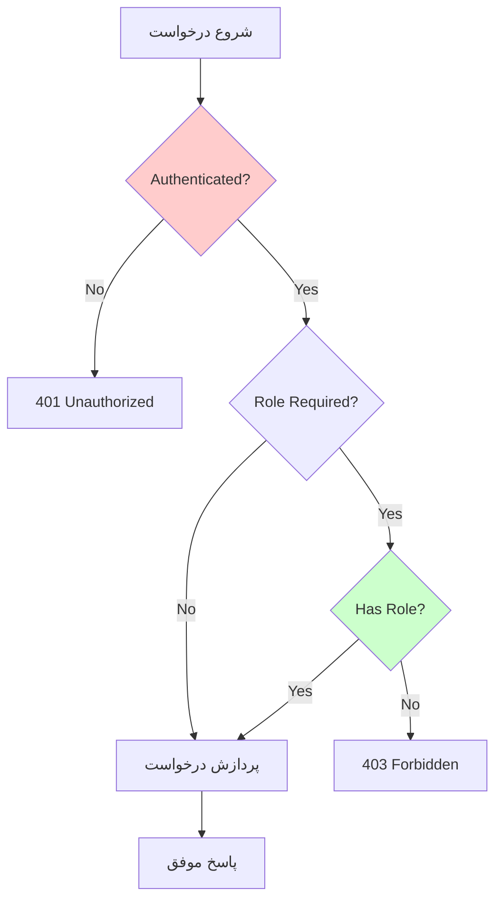

---

## خلاصه آمار سیستم

### آمار Entity ها
- **تعداد کل**: 36 Entity
- **جداول اصلی**: 34 جدول
- **جداول واسط (Junction)**: 2 جدول
- **ارتباطات One-to-Many**: 45+ رابطه
- **ارتباطات Many-to-Many**: 2 رابطه

### آمار Features و Use Cases
- **تعداد Features**: 27 Feature
- **تعداد Commands**: ~95 Command
- **تعداد Queries**: ~70 Query
- **تعداد کل Use Cases**: ~165

### آمار DTOs
- **تعداد کل DTOs**: ~90 DTO
- **Create DTOs**: ~27
- **Update DTOs**: ~25
- **Response DTOs**: ~30
- **سایر DTOs**: ~8

### آمار Validators
- **تعداد کل Validators**: ~55 Validator
- **پوشش**: تمام Create و Update DTOs

### آمار AutoMapper Profiles
- **تعداد کل**: 28 Profile
- **تعداد Mappings**: ~85 Mapping

### آمار Repositories
- **تعداد Interface ها**: 32 Interface
- **تعداد Implementations**: 32 Class

### آمار Controllers و Endpoints
- **تعداد Controllers**: 28 Controller
- **تعداد تقریبی Endpoints**: ~140 Endpoint
  - GET: ~70
  - POST: ~40
  - PUT: ~25
  - DELETE: ~5

### آمار Migrations
- **تعداد کل**: 23 Migration
- **جداول ایجاد شده**: 34+ جدول

---

## کلیدواژه‌های فنی

### Design Patterns
- **Clean Architecture**: معماری لایه‌بندی شده
- **CQRS**: جداسازی Command و Query
- **Repository Pattern**: الگوی دسترسی به داده
- **Mediator Pattern**: الگوی میانجی (MediatR)
- **Factory Pattern**: در Entity ها (Create methods)
- **Dependency Injection**: تزریق وابستگی
- **Unit of Work**: در DbContext

### Principles
- **SOLID Principles**: اصول طراحی شی‌گرا
- **DRY**: Don't Repeat Yourself
- **KISS**: Keep It Simple, Stupid
- **YAGNI**: You Aren't Gonna Need It
- **Separation of Concerns**: جداسازی نگرانی‌ها
- **Single Responsibility**: مسئولیت واحد

### Best Practices
- **Eager Loading**: بارگذاری پیشگیرانه با Include
- **Lazy Loading**: غیرفعال (برای Performance)
- **Soft Delete**: حذف منطقی
- **Query Filters**: فیلترهای خودکار
- **Optimistic Concurrency**: با RowVersion
- **Immutable Entities**: استفاده از private setters
- **Value Objects**: برای مفاهیم دامین
- **Rich Domain Models**: منطق در Entity ها

---

## نقشه راه توسعه (Development Roadmap)

### فازهای تکمیل شده ✅

1. ✅ **فاز 1**: SMS Service & OTP Authentication
2. ✅ **فاز 2**: Enhanced Product Entities (Brand, Variant, Material, Season)
3. ✅ **فاز 3**: CRUD Operations & DTOs
4. ✅ **فاز 4**: Advanced Product Search
5. ✅ **فاز 5**: Related Products & Recently Viewed
6. ✅ **فاز 6**: Coupon & Discount System
7. ✅ **فاز 7**: Order Status Timeline & Tracking
8. ✅ **فاز 8**: Stock Alerts & Notifications

### فازهای در انتظار 🔄

9. 🔄 **فاز 9**: Unit Tests (هدف: 250+ تست)
   - تکمیل تست‌های Command Handlers
   - تکمیل تست‌های Query Handlers
   - تست Validators
   - تست Domain Logic

10. 🔄 **فاز 10**: Integration Tests
    - تست End-to-End Scenarios
    - تست User Journeys
    - Performance Tests

### فازهای آینده 📋

11. **فاز 11**: Payment Gateway Integration
12. **فاز 12**: Email Notification System
13. **فاز 13**: Admin Dashboard
14. **فاز 14**: Product Recommendation Engine
15. **فاز 15**: Analytics & Reporting
16. **فاز 16**: Multi-language Support
17. **فاز 17**: Caching Layer (Redis)
18. **فاز 18**: Message Queue (RabbitMQ)
19. **فاز 19**: Microservices Migration
20. **فاز 20**: Mobile API Optimization

---

## مراجع و منابع

### Clean Architecture
- Clean Architecture: A Craftsman's Guide to Software Structure and Design (Robert C. Martin)
- https://blog.cleancoder.com/uncle-bob/2012/08/13/the-clean-architecture.html

### CQRS
- https://martinfowler.com/bliki/CQRS.html
- https://docs.microsoft.com/en-us/azure/architecture/patterns/cqrs

### ASP.NET Core
- https://docs.microsoft.com/en-us/aspnet/core/
- https://docs.microsoft.com/en-us/ef/core/

### Patterns & Practices
- Domain-Driven Design (Eric Evans)
- Implementing Domain-Driven Design (Vaughn Vernon)
- Patterns of Enterprise Application Architecture (Martin Fowler)

---

## پیوست‌ها

### A. لیست کامل Entities با ویژگی‌ها

| # | Entity | تعداد Properties | روابط | توضیحات |
|---|--------|------------------|-------|---------|
| 1 | ApplicationUser | 15+ | 10 رابطه | کاربر سیستم (Identity) |
| 2 | UserProfile | 12 | 1 رابطه | پروفایل کامل کاربر |
| 3 | UserAddress | 15 | 1 رابطه | آدرس‌های کاربر |
| 4 | Otp | 7 | - | کدهای یکبار مصرف |
| 5 | RefreshToken | 6 | 1 رابطه | توکن‌های تازه‌سازی |
| 6 | Product | 25+ | 15+ رابطه | محصول اصلی |
| 7 | ProductCategory | 8 | 2 رابطه | دسته‌بندی |
| 8 | Brand | 5 | 1 رابطه | برند |
| 9 | Material | 4 | 1 رابطه | جنس |
| 10 | Season | 3 | 1 رابطه | فصل |
| 11 | Unit | 4 | 1 رابطه | واحد |
| 12 | ProductVariant | 10 | 1 رابطه | تنوع |
| 13 | ProductImage | 10 | 1 رابطه | تصویر |
| 14 | ProductDetail | 6 | 1 رابطه | جزئیات فنی |
| 15 | ProductInventory | 9 | 1 رابطه | موجودی |
| 16 | ProductReview | 14 | 2 رابطه | نظرات |
| 17 | ProductRelation | 6 | 2 رابطه | محصولات مرتبط |
| 18 | Cart | 6 | 2 رابطه | سبد خرید |
| 19 | CartItem | 6 | 2 رابطه | آیتم سبد |
| 20 | SavedCart | 6 | 2 رابطه | سبد ذخیره شده |
| 21 | UserOrder | 20+ | 5 رابطه | سفارش |
| 22 | UserOrderItem | 9 | 2 رابطه | آیتم سفارش |
| 23 | UserPayment | 16 | 2 رابطه | پرداخت |
| 24 | OrderStatusHistory | 6 | 1 رابطه | تاریخچه وضعیت |
| 25 | UserReturnRequest | 15 | 3 رابطه | درخواست مرجوعی |
| 26 | Wishlist | 5 | 2 رابطه | علاقه‌مندی |
| 27 | Coupon | 15 | 1 رابطه | کوپن تخفیف |
| 28 | UserCouponUsage | 5 | 3 رابطه | استفاده از کوپن |
| 29 | StockAlert | 8 | 2 رابطه | هشدار موجودی |
| 30 | UserProductView | 6 | 2 رابطه | بازدید محصول |
| 31 | MahakMapping | 8 | - | نگاشت Mahak |
| 32 | MahakQueue | 12 | - | صف همگام‌سازی |
| 33 | MahakSyncLog | 11 | - | لاگ همگام‌سازی |
| 34 | SyncErrorLog | 12 | - | لاگ خطاها |
| 35 | ProductMaterial | 2 | 2 رابطه | واسط محصول-جنس |
| 36 | ProductSeason | 2 | 2 رابطه | واسط محصول-فصل |

---

### B. لیست کامل Features با تعداد Commands/Queries

| # | Feature | Commands | Queries | DTOs | Validators |
|---|---------|----------|---------|------|------------|
| 1 | Auth | 8 | 0 | 12 | 10 |
| 2 | Product | 4 | 6 | 6 | 2 |
| 3 | Brand | 3 | 2 | 3 | 2 |
| 4 | Material | 3 | 2 | 3 | 2 |
| 5 | Season | 3 | 2 | 3 | 2 |
| 6 | ProductVariant | 3 | 3 | 3 | 2 |
| 7 | ProductCategory | 3 | 3 | 4 | 2 |
| 8 | ProductImage | 4 | 2 | 3 | 2 |
| 9 | ProductDetail | 3 | 2 | 1 | 2 |
| 10 | ProductInventory | 6 | 3 | 3 | 2 |
| 11 | ProductReview | 6 | 3 | 1 | 4 |
| 12 | Cart | 6 | 3 | 1 | 4 |
| 13 | SavedCart | 3 | 3 | 3 | 2 |
| 14 | Checkout | 3 | 1 | 3 | 1 |
| 15 | UserOrder | 8 | 4 | 4 | 2 |
| 16 | UserPayment | 4 | 3 | 3 | 2 |
| 17 | UserAddress | 4 | 3 | 1 | 2 |
| 18 | UserProfile | 4 | 2 | 1 | 2 |
| 19 | UserReturnRequest | 5 | 4 | 5 | 4 |
| 20 | Wishlist | 3 | 2 | 1 | 2 |
| 21 | Coupon | 5 | 4 | 5 | 2 |
| 22 | StockAlert | 3 | 2 | 3 | 1 |
| 23 | Unit | 3 | 2 | 4 | 2 |
| 24 | MahakMapping | 3 | 2 | 1 | 0 |
| 25 | MahakQueue | 3 | 2 | 1 | 0 |
| 26 | MahakSyncLog | 3 | 2 | 1 | 0 |
| 27 | SyncErrorLog | 3 | 2 | 1 | 0 |

**جمع کل:**
- Commands: ~95
- Queries: ~70
- DTOs: ~90
- Validators: ~55

---

### C. لیست کامل API Endpoints

#### Authentication (8 endpoints)
- POST /api/auth/register
- POST /api/auth/login
- POST /api/auth/send-otp
- POST /api/auth/verify-otp
- POST /api/auth/register-phone
- POST /api/auth/login-phone
- POST /api/auth/refresh-token
- POST /api/auth/logout

#### Product (10+ endpoints)
- GET /api/product
- GET /api/product/{id}
- POST /api/product (Admin)
- PUT /api/product/{id} (Admin)
- DELETE /api/product/{id} (Admin)
- POST /api/product/search
- GET /api/product/{id}/related
- GET /api/product/{id}/frequently-bought-together
- GET /api/product/recently-viewed
- POST /api/product/track-view

#### Brand (5 endpoints)
- GET /api/brand
- GET /api/brand/{id}
- POST /api/brand (Admin)
- PUT /api/brand/{id} (Admin)
- DELETE /api/brand/{id} (Admin)

#### Material (5 endpoints)
- GET /api/material
- GET /api/material/{id}
- POST /api/material (Admin)
- PUT /api/material/{id} (Admin)
- DELETE /api/material/{id} (Admin)

#### Season (5 endpoints)
- GET /api/season
- GET /api/season/{id}
- POST /api/season (Admin)
- PUT /api/season/{id} (Admin)
- DELETE /api/season/{id} (Admin)

#### ProductVariant (6 endpoints)
- GET /api/productvariant
- GET /api/productvariant/{id}
- GET /api/productvariant/product/{productId}
- POST /api/productvariant (Admin)
- PUT /api/productvariant/{id} (Admin)
- DELETE /api/productvariant/{id} (Admin)

#### Cart (8 endpoints)
- GET /api/cart
- POST /api/cart/add
- PUT /api/cart/update
- DELETE /api/cart/remove/{productId}
- POST /api/cart/clear
- GET /api/cart/count
- GET /api/cart/total
- POST /api/cart/migrate-guest

#### Checkout (3 endpoints)
- POST /api/checkout/initiate
- POST /api/checkout/apply-coupon
- POST /api/checkout/complete

#### Order (12+ endpoints)
- GET /api/order
- GET /api/order/{id}
- GET /api/order/my-orders
- POST /api/order
- PUT /api/order/{id} (Admin)
- DELETE /api/order/{id}/cancel
- PUT /api/order/{id}/process (Admin)
- PUT /api/order/{id}/ship (Admin)
- PUT /api/order/{id}/deliver (Admin)
- GET /api/order/{id}/timeline
- GET /api/order/tracking/{trackingNumber}
- GET /api/order/{id}/invoice

#### Review (8+ endpoints)
- GET /api/productreview/{id}
- GET /api/productreview/product/{productId}
- POST /api/productreview
- PUT /api/productreview/{id}
- DELETE /api/productreview/{id}
- PUT /api/productreview/{id}/approve (Admin)
- PUT /api/productreview/{id}/reject (Admin)
- GET /api/productreview/pending (Admin)

#### Coupon (7 endpoints)
- GET /api/coupon
- GET /api/coupon/{id}
- GET /api/coupon/code/{code}
- POST /api/coupon (Admin)
- PUT /api/coupon/{id} (Admin)
- DELETE /api/coupon/{id} (Admin)
- POST /api/coupon/validate

#### Return Request (8 endpoints)
- GET /api/userreturnrequest
- GET /api/userreturnrequest/{id}
- GET /api/userreturnrequest/my-requests
- GET /api/userreturnrequest/pending (Admin)
- POST /api/userreturnrequest
- PUT /api/userreturnrequest/{id}
- PUT /api/userreturnrequest/{id}/approve (Admin)
- PUT /api/userreturnrequest/{id}/reject (Admin)

... و ~60 endpoint دیگر برای سایر Features

**جمع کل تقریبی: ~140 Endpoint**

---

### D. نگاشت کامل Request → Code → Database

**مثال: ایجاد محصول جدید**

1. **Request**:
```http
POST /api/product
Content-Type: application/json
Authorization: Bearer {token}

{
  "name": "تیشرت مردانه",
  "description": "تیشرت پنبه‌ای با کیفیت بالا",
  "price": 250000,
  "stockQuantity": 50,
  "categoryId": "guid",
  "unitId": "guid",
  "brandId": "guid"
}
```

2. **Controller** (`ProductController.cs`):
```csharp
[HttpPost]
[Authorize(Roles = "Admin")]
public async Task<IActionResult> Create([FromBody] CreateProductDto dto)
{
    var command = new CreateProductCommand { Product = dto };
    var result = await _mediator.Send(command);
    
    return result.IsSuccess
        ? CreatedAtAction(nameof(GetById), new { id = result.Value }, result.Value)
        : BadRequest(result.ErrorMessage);
}
```

3. **Command** (`CreateProductCommand.cs`):
```csharp
public class CreateProductCommand : IRequest<Result<Guid>>
{
    public CreateProductDto Product { get; set; }
}
```

4. **Validator** (`CreateProductDtoValidator.cs`):
```csharp
public class CreateProductDtoValidator : AbstractValidator<CreateProductDto>
{
    public CreateProductDtoValidator()
    {
        RuleFor(x => x.Name).NotEmpty().MaximumLength(200);
        RuleFor(x => x.Price).GreaterThan(0);
        RuleFor(x => x.StockQuantity).GreaterThanOrEqualTo(0);
    }
}
```

5. **Handler** (`CreateProductCommandHandler.cs`):
```csharp
public class CreateProductCommandHandler : IRequestHandler<CreateProductCommand, Result<Guid>>
{
    private readonly IProductRepository _repository;
    private readonly IMapper _mapper;

    public async Task<Result<Guid>> Handle(CreateProductCommand request, CancellationToken cancellationToken)
    {
        // Map DTO to Entity
        var product = Product.Create(
            request.Product.Name ?? string.Empty,
            request.Product.Description ?? string.Empty,
            request.Product.Price ?? 0,
            request.Product.StockQuantity ?? 0,
            null, null
        );

        // Save to database
        var created = await _repository.AddAsync(product, cancellationToken);

        return Result<Guid>.Success(created.Id);
    }
}
```

6. **Repository** (`ProductRepository.cs`):
```csharp
public async Task<Product> AddAsync(Product entity, CancellationToken cancellationToken = default)
{
    await _context.Products.AddAsync(entity, cancellationToken);
    await _context.SaveChangesAsync(cancellationToken);
    return entity;
}
```

7. **Database Query** (Generated by EF Core):
```sql
INSERT INTO "Products" ("Id", "Name", "Description", "Price", "StockQuantity", "CategoryId", "UnitId", "BrandId", "CreatedAt", "Deleted")
VALUES (@p0, @p1, @p2, @p3, @p4, @p5, @p6, @p7, @p8, @p9);
```

8. **Response**:
```json
{
  "guid-of-created-product"
}
```

**Location Header:**
```
Location: /api/product/{created-guid}
```

---

## نتیجه‌گیری

سیستم OnlineShop یک پلتفرم فروشگاه آنلاین جامع و مدرن است که با بهترین روش‌های معماری نرم‌افزار طراحی شده است. استفاده از Clean Architecture، CQRS، و اصول SOLID باعث شده این سیستم:

- **قابل توسعه**: افزودن ویژگی‌های جدید آسان است
- **قابل تست**: تست واحد و یکپارچه‌سازی ساده است
- **قابل نگهداری**: کد خوانا و سازماندهی شده
- **مقیاس‌پذیر**: آماده برای رشد
- **امن**: با مکانیزم‌های احراز هویت قوی

### نقاط قوت

1. **معماری تمیز و لایه‌بندی شده**
2. **جداسازی کامل نگرانی‌ها**
3. **استفاده از الگوهای مدرن (CQRS, Repository, Mediator)**
4. **اعتبارسنجی قوی با FluentValidation**
5. **Logging جامع با Serilog**
6. **احراز هویت چندگانه (Email, Phone, OTP)**
7. **مدیریت موجودی پیشرفته**
8. **سیستم تخفیف و کوپن قدرتمند**
9. **ردیابی کامل سفارشات**
10. **یکپارچگی با Mahak ERP**

### زمینه‌های بهبود

1. **افزایش تست‌های واحد** (از 158 به 250+)
2. **افزودن تست‌های یکپارچه‌سازی** (40+ سناریو)
3. **پیاده‌سازی Caching** (Redis) برای بهبود Performance
4. **افزودن Email Notification**
5. **ایجاد Admin Dashboard**
6. **پیاده‌سازی Real-time Notifications** (SignalR)
7. **افزودن CDN** برای تصاویر
8. **بهینه‌سازی Queries** با Dapper در صورت نیاز

---

**تهیه شده توسط:** تیم معماری OnlineShop  
**آخرین به‌روزرسانی:** مهر 1404  
**نسخه مستند:** 1.0


